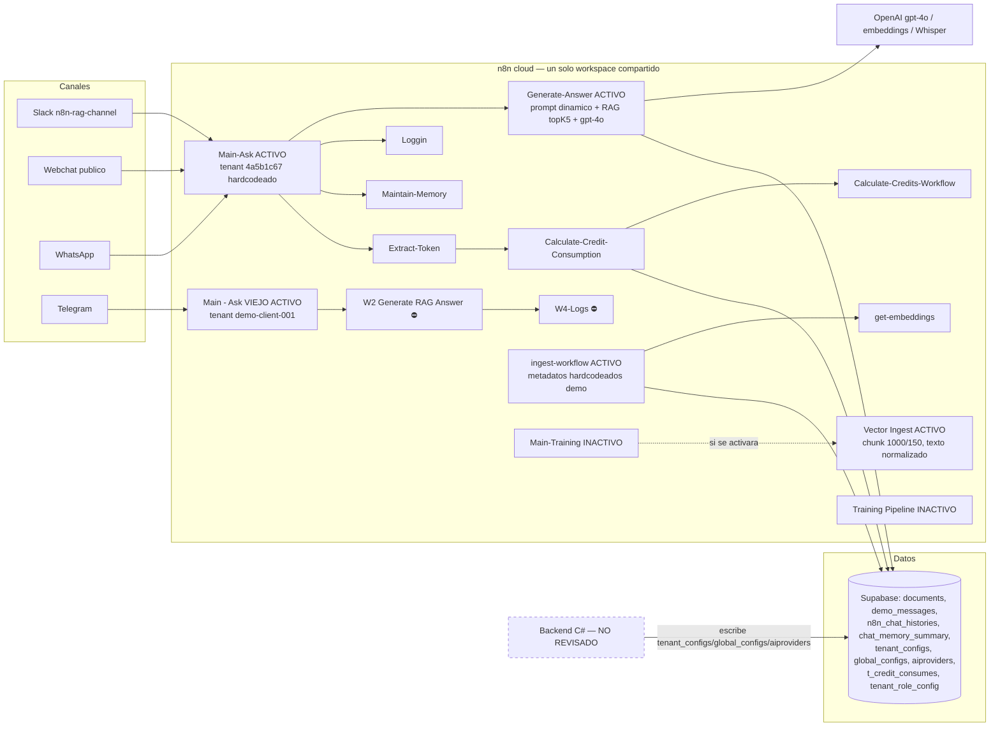

# Berry Nova — Revisión técnica enfocada (no seguridad) — 2026-07-31

**Fecha:** 2026-07-31 · **Revisor:** Claude (revisión profunda automatizada, solo lectura)
**Versión:** 2.0 — actualiza y sustituye el informe del 2026-07-06 (`berrynova-technical-review-2026-07-06.md`, en inglés, conservado en el repositorio).
**Objetivos:** `CodeBerry-Solutions/backend-berrynova`, `frontend-berrynova`, `berrynova_services`, y el espacio de trabajo n8n (`phildelude.app.n8n.cloud`).
**Documento compañero respetado:** «Berry Nova — Known findings (non-security)» — nada de esa lista se re-reporta; los hallazgos marcados como *extensión* indican explícitamente su delta.

---

## 1. Qué cambió desde el informe del 06-07 (léase primero)

El 2026-07-06 (14:24–14:32 UTC) el equipo actualizó los workflows de producción **y activó el acceso MCP** en la mayoría de ellos. Esta versión 2.0 se basa por primera vez en las **definiciones reales de producción**, no en borradores antiguos:

1. **Ahora legibles y leídos en su totalidad:** Main-Ask (`2QZLXI9gEJosDm3d`), Generate-Answer (`6wZupSeAs74HDx0s`), Vector Ingest activo (`DK0JVEqKAbfaBY47`), Calculate-Credit-Consumption (`TXFzgfqguTyJxUxy`), Calculate-Credits-Workflow (`pk1QQrNB8WnFhBDS`), Extract-Token (`pdCkPbu8wSpuxj2N`), Main - Ask/Telegram (`VqmMlELvgq8uVXvT`), Main-Training (`tG0ExU9N3a4VA8MH`), ingest-workflow (`p6xsMbhLbrywYNVG`).
2. **Varias extrapolaciones de la v1 quedan confirmadas, otras corregidas** (ver §6: cada hallazgo lleva su estado actualizado). Las correcciones más importantes a favor del equipo: la recuperación **sí** filtra por tenant y agrega los 5 fragmentos en **una sola** llamada al modelo (el defecto de «una llamada por fragmento» del ancestro quedó corregido en la pila nueva); las tarifas de créditos viven en base de datos (`aiproviders`), no en código; y el extractor de tokens sí devuelve su resultado al llamador.
3. **Los dos «stacks» activos quedan explicados:** no compiten por el mismo mensaje. `Main-Ask` (nuevo) atiende Slack + webchat + WhatsApp; `Main - Ask` (viejo) atiende **Telegram** con la familia antigua (W2/W4-Logs), **otro tenant hardcodeado distinto** y **sin medición de créditos alguna**.
4. **Hallazgos nuevos de esta pasada** (§6.0): plantilla de system prompt con *fallback* vacío; rama de «roles/personas» desconectada; el mínimo de créditos jamás se aplica; tarifas ausentes → 1 token = 1 crédito; el ingest activo escribe metadatos hardcodeados de demo; mensajes de voz/no-texto se descartan en silencio; `should_escalate` no lo consume nadie.
5. **Los tres repositorios siguen inaccesibles desde esta sesión** (sesión anclada a la organización GitHub `CodeBerrySolutions`; los repos viven en `CodeBerry-Solutions`). La parte de repositorios sigue **sin revisar** aquí; el diagnóstico del entorno local confirmó que allí sí hay acceso vía git.
6. **Sigue sin haber historial de ejecuciones** (0 ejecuciones retenidas): ningún hallazgo pudo confirmarse en runtime.

---

## 2. Resumen ejecutivo

**Qué hace el sistema.** Berry Nova es un asistente de IA multi-tenant: chatbot con RAG por canales (Slack, webchat, WhatsApp, Telegram), alimentado por ingesta de conocimiento (Drive, audio, imagen, scraping), con consumo medido en créditos y suscripciones/pagos en los servicios C#. n8n es el middleware confirmado del «cerebro» de IA; el cerebro Python se retira.

**Madurez aparente.** Repos: **desconocida — no revisados desde esta sesión**. Capa n8n: **prototipo organizativo sirviendo tráfico real**, con mejoras visibles el 06-07 (agregación de contexto, filtro por tenant en recuperación, prompt dinámico desde BD), pero aún: 62 workflows sin etiquetas ni separación dev/prod, dos pilas activas paralelas con tenants hardcodeados distintos, medición de créditos con errores estructurales y cero observabilidad.

**Los cinco riesgos no-seguridad más importantes (estado 2026-07-31):**
1. **La medición de créditos es estructuralmente incorrecta** (H-05, H-06, N-03): el extractor de tokens depende de un historial de ejecuciones que está apagado (⇒ débitos probablemente en cero), el mínimo de créditos se recibe pero **nunca se aplica**, una tarifa ausente en `aiproviders` degrada a **1 token = 1 crédito** (sobrecargo masivo), el canal Telegram **no mide nada**, y la fila de consumo se inserta con UUID aleatorio (sin idempotencia) directamente en `t_credit_consumes`, tabla del wallet C#.
2. **El corpus RAG no tiene identidad de documento ni ciclo de vida** (H-01…H-04): `source_id` con marca de tiempo (ningún purgado puede coincidir jamás), el DELETE corre **en paralelo** con la inserción (el arreglo previsto de IA-777 se volvería un borrado no determinista), cada archivo nuevo re-ingesta la **carpeta completa**, y los DOCX siguen cayendo al cargador binario (basura facturada y recuperable). Además, **hoy no hay ingesta automática**: ambos workflows de entrenamiento están inactivos, y el único punto de entrada activo (`ingest-workflow`) escribe **metadatos hardcodeados de demo** (N-04) que hacen esos fragmentos invisibles para la recuperación.
3. **El prompt del sistema puede quedar vacío en silencio** (N-01): el código dice «si falta la fila en BD, usa la copia embebida» — y la copia embebida es una **cadena vacía**. Si la fila `SystemPrompt:DefaultSystemPrompt` de `global_configs` falta o falla la lectura, el bot responde sin reglas, sin grounding y sin aviso.
4. **Dos pilas activas con dos verdades distintas** (H-07 revisado): Telegram vive en la familia antigua (tenant `demo-client-001`, logs en W4-Logs, sin créditos); Slack/webchat/WhatsApp en la nueva (tenant UUID `4a5b1c67-…`, logs en Loggin, con créditos). Mismo producto, dos comportamientos, dos contabilidades, y cualquier arreglo hay que hacerlo dos veces.
5. **Sin red operativa**: 0 ejecuciones retenidas, ningún `onError`/reintento/timeout, sin workflow de errores, sin separación de entornos, credenciales de producción en proyectos personales. Todos los fallos anteriores son silenciosos.

**¿Apto para su uso actual? ¿Listo para producción? ¿Escala?** Como demo/piloto de un solo cliente con supervisión humana: sí funciona, y mejoró. Como middleware de producción multi-tenant: **no todavía** — la facturación no es verificable ni correcta, el re-entrenamiento corrompe en vez de reemplazar, el tenant está hardcodeado en ambas pilas (no hay multi-tenancy real operativa) y no hay forma de saber cuándo algo falla. No escala con seguridad ni en tenants, ni en corpus, ni en tráfico.

**Acción inmediata más importante.** Encender el guardado/retención de ejecuciones y arreglar la cadena de medición (H-05/N-03): hasta entonces cada débito de chat es probablemente 0 y nadie lo sabe. En paralelo, poblar el *fallback* vacío del prompt (N-01) — es una línea.

**Acción arquitectónica más importante (rumbo n8n-middleware).** Consolidar en **una** pila canónica parametrizada («tenant como dato, no como clon»), con el tenant resuelto desde el canal (no hardcodeado), registro de tenants, JSON de workflows versionado en git, entornos dev/prod separados, y el asiento contable de créditos detrás de una única API idempotente del wallet C# en vez de inserciones directas desde n8n. Retirar Python colapsa la duplicación Python/C#, pero la duplicación **ya renació dentro de n8n** (dos pilas por canal) y la pista Weaviate (plantilla + Orquestador) mantiene vivo el split-brain de almacenes salvo que se mate explícitamente.

**Mayor incertidumbre.** Los tres repositorios (0 % revisados desde aquí) y todo lo que solo se confirma en runtime (0 ejecuciones): montos reales debitados, comportamiento del extractor de tokens, frecuencia de ingesta.

**Riesgo global (capa n8n, no seguridad): ALTO** — por integridad de facturación, integridad del corpus y estructura de gestión de cambios; no por un único defecto catastrófico.

---

## 3. El recorrido de una pregunta (flujo verificado, pila nueva)

```mermaid
sequenceDiagram
  participant U as Usuario (Slack / webchat / WhatsApp)
  participant MA as Main-Ask (n8n)
  participant GA as Generate-Answer (n8n)
  participant BD as Supabase/Postgres
  participant V as documents (pgvector)
  participant O as OpenAI
  U->>MA: mensaje
  MA->>MA: normaliza canal; tenant_id HARDCODEADO (4a5b1c67-…)
  MA->>BD: INSERT demo_messages (rol user)
  MA->>GA: question, tenant, session_id = external_user_id
  GA->>BD: resumen de conversación (chat_memory_summary)
  GA->>BD: configs de comportamiento (tenant_configs: BotSetting.*, ChatSettings.*)
  GA->>BD: plantilla maestra (global_configs: SystemPrompt:DefaultSystemPrompt)
  GA->>BD: débito de embedding de la pregunta (cadena bloqueante)
  GA->>V: match_documents — topK=5, filtro metadata tenant_id
  GA->>GA: agrega los 5 fragmentos + configs + resumen en el system prompt
  GA->>O: 1 llamada gpt-4o (memoria Postgres: últimas 8 vueltas)
  GA-->>MA: sobre JSON {answer, confidence, intent, should_escalate}
  par en paralelo
    MA->>BD: Loggin (pregunta/respuesta/fragmentos)
    MA->>MA: Extract-Token → Calculate-Credit → INSERT t_credit_consumes
    MA->>BD: Maintain-Memory (resumir y podar historial)
    MA->>U: respuesta por el canal de origen
  end
```

Puntos clave verificados del ensamblado del prompt (nodo `Build System Prompt`):
- La plantilla llega de `global_configs`; los **configs de comportamiento** llegan de `tenant_configs` (claves `BotSetting.CommunicationTone/Rules/AnswerLength/ExpertName/DomainDescription/ConversationGoal…`, `ChatSettings.Title/DefaultLanguage`) y se releen **en cada pregunta** — un cambio guardado desde el backend/staging aplica al mensaje siguiente sin redespliegue.
- Marcadores rellenados: `{TENANT_RULES}`, `{tenant_context}` (los 5 fragmentos como «[Fragmento N]…»), `{conversation_summaries}`, `{user_language}`, `{chat_title}`, `{expert_name}`, `{domain_description}`, `{conversation_objective_*}`, `{FRUSTRATION_RULE}`. Vacíos por diseño: `{user_memory}`, `{recent_files_context}`, `{other_session_files_context}`.
- Recuperación: pregunta → embedding OpenAI (modelo sin fijar, 1536 dims) → `match_documents` sobre `documents`, **topK = 5 siempre**, filtro `tenant_id` (sin umbral de similitud).
- Respuesta: **una** llamada gpt-4o con memoria Postgres (clave `tenant:external_user_id`, ventana 8 vueltas) y parser tolerante del sobre JSON.

**Chunking (re-evaluado, tal como pidió el equipo).** En el `Vector Ingest` activo todo se normaliza a texto antes de trocear: PDF → extracción de texto; **XLSX → una línea «columna: valor | columna: valor» por fila**; audio → Whisper (temp 0); imagen → descripción exhaustiva con gpt-4o. Luego el `Recursive Character Text Splitter` corta en **~1.000 caracteres (tamaño por defecto, no fijado explícitamente) con solape de 150**. Metadatos escritos por chunk: `tenant_id`, `source_id`, `source_title` — **sigue sin escribirse `file_name`**, así que el DELETE de IA-777 sigue siendo un no-op. El *fallback* de tipos desconocidos (DOCX incluido) sigue yendo al cargador binario crudo.

---

## 4. Mapa de sistema (actualizado)



Observaciones transversales confirmadas:
- **n8n escribe directamente en tablas de dominio del backend C#** (`t_credit_consumes` con columnas `CreditType/AIModelType/OperationTypeId`; `tenant_configs`/`global_configs`/`aiproviders` en el otro sentido). El patrón «monolito distribuido sobre un esquema compartido» (SYS-04, conocido) queda verificado del lado n8n.
- **Propiedad de datos coherente en lectura, incoherente en escritura**: la configuración fluye backend→BD→n8n (bien); la contabilidad fluye n8n→BD-del-backend sin API ni idempotencia (mal).
- La rama Weaviate (plantilla + Orquestador) sigue existiendo como única implementación de aprovisionamiento por tenant → el split-brain de almacenes **no** muere solo con retirar Python.

---

## 5. Cobertura de esta versión

**Leídos íntegros (nodo a nodo) a 2026-07-31:** `2QZLXI9gEJosDm3d`, `6wZupSeAs74HDx0s`, `DK0JVEqKAbfaBY47`, `TXFzgfqguTyJxUxy`, `pk1QQrNB8WnFhBDS`, `pdCkPbu8wSpuxj2N`, `VqmMlELvgq8uVXvT`, `tG0ExU9N3a4VA8MH`, `p6xsMbhLbrywYNVG`, más los 14 de la v1 (`fWLldKcDc7V47yns`, `cMaFNGoo4doQG3jf`, `pzzyMucefLDu43Rq`, `RrXc4CD4OqltEzKx`, `AbWkVJD4vS6ySYvI`, `tti62FYYs9xkPRE6`, `PueN3scDC2IhHSFp`, `5p5Kn2YB2E6dAkpS`, `m9saGWLWmpwae0tE`, `mmCGBfyb89S4KPAo`, `GaOGKael5p4q96Qp`, `T0Zt9USiCtB1LvmO`, `hpEQSsrpveCPPqvA`, `KFy9XpRm2459Ap40`).
**Aún bloqueados por MCP:** `y9RdSZoVCPVVI8P8` (Transcribe Audio, ACTIVO), `wog5Hz97eijBCLLJ` (W2, ACTIVO), `cUZCu0db6MOVth2h` (Generate-Answer viejo, ACTIVO), `3qdr0WLgMKFhrHHO` (Loggin viejo, ACTIVO), `r2G2YNbFsYKHj8N5` (W4-Logs, ACTIVO), `UdoBOmU0zCtogNWr` (Enmanuel-Ask, ACTIVO), Drive Generic, Jose-Duplicate, plantillas MT/RAG y borradores. **La pila vieja (Telegram) sigue siendo mayormente ilegible.**
**No leídos por naturaleza:** contenido de `global_configs`/`tenant_configs`/`aiproviders` (datos en BD, no definiciones de workflow) — el texto real del prompt maestro y las tarifas vigentes no pudieron citarse. `Wwt0tHF7N3du32GM` (Maintain-Memory activo) y `Na8fMaywTOM31uLP` (Loggin nuevo) y `uaJCUNsYAyboufik` (get-embeddings) están habilitados pero no se leyeron en profundidad en esta pasada.
**Repositorios:** 0 % revisados desde esta sesión (bloqueo de organización GitHub; detalle en v1 §5). **Ejecuciones:** 0 retenidas; nada confirmado en runtime.

---

## 6. Hallazgos

Formato abreviado; severidad / verificación / confianza al inicio. «Extensión» = amplía un ítem del documento de hallazgos conocidos con delta explícito. IDs `H-xx` = hallazgos de v1 actualizados (antes `NEW-xx`); `N-xx` = nuevos de esta versión.

### 6.0 Nuevos (evidencia del 06-07 / 31-07)

**[N-01] — El fallback del prompt maestro es una cadena vacía: el bot puede quedarse sin instrucciones en silencio.**
Alta · Verificado (estático) · Confianza alta · No conocido.
`Generate-Answer › Build System Prompt`: `const EMBEDDED_TEMPLATE = "";` con el comentario «Falls back to the embedded copy … so the live bot can't break». Si la fila `SystemPrompt:DefaultSystemPrompt` de `global_configs` falta, está vacía o la lectura falla, `system_prompt` queda `""`: sin reglas de tenant, sin instrucción de grounding, sin idioma — y ningún error. **Remedio:** incrustar una copia real de la plantilla y alertar si la fila no aparece. Esfuerzo XS · Riesgo bajo.

**[N-02] — El sistema de personas por rol existe pero está desconectado.**
Media (decisión de producto pendiente) · Verificado · Confianza alta · No conocido.
`Obterner Role Cfg` (lee `tenant_role_config`) → `Construir Role Prompt` (personas cliente/lead/tenant con tono, reglas de venta, temas prohibidos y **filtro RAG por rol**) están en `Generate-Answer` sin ninguna conexión de entrada ni de salida: nunca se ejecutan. Su propio comentario describe cómo debería cablearse. Si alguien cree que el comportamiento por rol o el filtrado por rol está activo, no lo está: la única fuente de comportamiento efectiva es `tenant_configs`. Además, el nodo filtra solo por `tenant_id`+`enabled` (sin filtro `role`), así que aun cableado devolvería una fila arbitraria. **Remedio:** decidir si se conecta (y filtrar por rol) o se elimina. Esfuerzo S · Riesgo medio.

**[N-03] — La matemática de créditos: el mínimo jamás se aplica, no hay redondeo, y tarifas ausentes degradan a «1 token = 1 crédito».**
Alta · Verificado (estático) · Confianza alta · No conocido (CR-08 conocido trata otro redondeo; esto es la implementación n8n vigente).
`Calculate-Credits-Workflow › Calculate Credits`: `minCredits` se lee y se devuelve en el detalle **pero `credits_consumed = rawCredits`** — nunca `max(rawCredits, minCredits)`; tampoco hay `ceil`/redondeo (créditos fraccionarios en `Amount`). Peor: `inputTokensPerCredit = Number(...) || 1` — si la fila de `aiproviders` falta o el valor es 0/nulo, cada token cuesta **1 crédito** (una respuesta normal ≈ miles de créditos). Y en `Calculate-Credit-Consumption`, el tenant cae al hardcodeado `|| '4a5b1c67-…'` si viene vacío (débitos sin tenant se cargan al demo), el `Id` del asiento es un UUID de `Math.random()` (reintento = fila nueva = doble cargo; gemelo n8n del conocido CR-04), y `CreditType=3`, `AIModelType=1`, `OperationTypeId=00000000-…` van fijos (analítica contable degradada). **Remedio:** aplicar el mínimo, redondear con política explícita, fallar si no hay tarifa, clave de idempotencia determinista (p. ej. execution_id), y a medio plazo debitar vía API del wallet C#. Esfuerzo S · Riesgo medio (ruta de facturación).

**[N-04] — El único punto de ingesta ACTIVO escribe metadatos hardcodeados de demo: sus chunks son invisibles para la recuperación.**
Alta · Verificado (estático) · Confianza alta · No conocido.
`ingest-workflow` (`p6xs…`, activo; recibe chunks ya troceados de un llamador externo — presumiblemente el backend) inserta en `documents` con `metadata` **literal**: `{"source_id":"faq-001","tenant_id":"1","source_title":"FAQ del cliente demo","source":"blob"…}` para *todo* chunk, y la columna `tenant_id` desde `$json.TenantId` (salida de `get-embeddings`; probablemente `undefined`). Como la recuperación filtra `metadata->>tenant_id` = UUID real, **nada ingerido por esta vía puede recuperarse jamás**, y el corpus acumula filas huérfanas. Nótese además que con ambos workflows de entrenamiento **inactivos**, esta vía rota es hoy la única ingesta activa. **Remedio:** mapear los metadatos desde las entradas declaradas (`tenant_id`, `source_id` reales); decidir cuál es la vía de ingesta canónica. Esfuerzo XS–S · Riesgo bajo.

**[N-05] — Mensajes de voz y no-texto se descartan en silencio en la pila nueva.**
Media · Verificado (estático) · Confianza alta · No conocido.
En `Main-Ask`: la rama «sí» del `If` de voz no conecta a nada y el nodo `Call 'Transcribe Audio'` está huérfano (entradas vacías, salida a la nada); en WhatsApp, la rama no-texto del `WA is text?` termina vacía. El usuario no recibe respuesta ni disculpa; no queda registro. (La pila Telegram vieja, en cambio, **sí** transcribe voz.) **Remedio:** cablear la transcripción (existe) o responder «no soporto audio aún». Esfuerzo XS–S · Riesgo bajo.

**[N-06] — `should_escalate` se genera pero nadie lo consume; `insufficient_context` va hardcodeado a `false`.** *(extensión del conocido «isEscalated never fires»)*
Media · Verificado · Confianza alta.
`Generate-Answer` produce `should_escalate` e `intent` en su salida final, pero `Main-Ask` no los usa (no van ni al log). Y `insufficient_context` se fija literalmente `={{ false }}`, de modo que el KPI de «no tenía contexto» que Loggin registra es siempre falso (el flag real `has_context` se calcula y se descarta). Delta frente al conocido: ya no es que el flag no exista — ahora existe y se tira. **Remedio:** propagar ambos al log y definir la acción de escalado. Esfuerzo XS · Riesgo bajo.

**[N-07] — El débito de embedding está en medio de la cadena de respuesta: si la facturación falla, el usuario no recibe respuesta.**
Media · Verificado (estático) · Confianza alta · No conocido.
`Generate-Answer`: …`Load System Prompt` → `Count Tokens` → `Calculate AI embedding credits` (espera al sub-workflow) → `Supabase Vector Store` → … Un fallo en Supabase/tarifas aborta la respuesta entera (sin onError). El débito además ocurre **antes** de recuperar y responder (se cobra aunque luego falle la respuesta). **Remedio:** sacar la medición del camino crítico (rama paralela post-respuesta). Esfuerzo S · Riesgo bajo.

**[N-08] — Hoy no existe ingesta automática desde Drive; el TEXT CONVERTER activo sigue huérfano.**
Media (operativo) · Verificado · Confianza alta.
`Main-Training` y `Training Pipeline` están **inactivos**; nadie llama a `pzzyMucefLDu43Rq` (TEXT CONVERTER, activo); la única ingesta activa es la vía rota de N-04. Si el negocio cree que «subir un archivo a Drive re-entrena al bot», hoy no ocurre. **Remedio:** decidir la vía canónica de entrenamiento y activarla tras arreglar H-01…H-04. Esfuerzo S (decisión) · Riesgo bajo.

**[N-09] — El tenant está hardcodeado en ambas pilas, con identificadores incompatibles.**
Alta (bloqueante para multi-tenancy) · Verificado · Confianza alta · No conocido (los hardcodes conocidos eran de la familia de entrenamiento).
Pila nueva: `tenant_id = '4a5b1c67-73e3-4455-aad2-77a8b1c6f9ec'` fijo para Slack/webchat/WhatsApp (y `channel_type` por defecto `'telegram'` en la rama Slack — analítica de canal mal etiquetada). Pila vieja: `tenant_id = 'demo-client-001'` fijo para Telegram. Dos formatos distintos (UUID vs slug) contra las mismas tablas. Ningún canal resuelve el tenant dinámicamente: la multi-tenancy no está operativa en el camino de chat. **Remedio:** resolver tenant desde la identidad del canal (registro de tenants); unificar el formato del identificador. Esfuerzo M · Riesgo medio.

**[N-10] — Mejoras confirmadas que conviene proteger (no son hallazgos, son activos).**
La pila nueva agrupa los 5 fragmentos en una sola llamada (corrige el fan-out del ancestro); la recuperación filtra por tenant; el prompt es dinámico desde BD y los cambios de comportamiento aplican al instante; el parser de salida es tolerante (el «error como respuesta» conocido queda mitigado en esta pila); las tarifas están en BD; la memoria es Postgres (ventana 8) + resumen persistente; la ingesta normaliza PDF/XLSX/audio/imagen a texto antes de trocear. Recomendación: tests de humo que fijen estos comportamientos antes de seguir refactorizando.

### 6.1 Altos (v1 actualizados)

**[H-01] — Purgado e inserción en paralelo** *(antes NEW-01)* — **Confirmado en `Main-Training` actual** (misma doble conexión desde `Edit Fields`). Sigue enmascarado porque el DELETE no coincide con nada; se volverá pérdida real al corregir el filtro de IA-777. Ambos workflows de entrenamiento inactivos ⇒ severidad efectiva latente, pero bloquea el arreglo estrella. Alta · Verificado.

**[H-02] — `source_id` con marca de tiempo; identidad de documento imposible** *(antes NEW-02)* — **Confirmado** (`source_id = fileName + $now.toMillis()`). Novedad: `Edit Fields` ahora también produce `file_name`, `mime_type`, `drive_id`… **pero el cargador del Vector Ingest activo sigue escribiendo solo `tenant_id`/`source_id`/`source_title`** en los metadatos del chunk ⇒ el DELETE por `file_name` sigue borrando cero filas (IA-777 sigue siendo no-op **verificado ahora en la versión activa**). Alta · Verificado.

**[H-03] — Re-ingesta de carpeta completa por cada archivo nuevo** *(antes NEW-03)* — **Confirmado** en `Main-Training` (búsqueda con query vacía y `returnAll` sobre la carpeta «Contenido N8N»). Latente mientras el entrenamiento esté inactivo. Alta · Verificado.

**[H-04] — DOCX y tipos no mapeados caen al cargador binario crudo** *(antes NEW-04)* — **Confirmado en el Vector Ingest ACTIVO**: la descarga convierte Google Docs a DOCX, el switch solo mapea PDF/XLSX/audio/imagen y el *fallback* va directo a `Prepare Ingest`. La basura se trocea, se factura y compite en la búsqueda. Alta · Verificado (antes era extrapolación; ya no).

**[H-05] — La extracción de tokens depende de un historial de ejecuciones apagado** *(antes NEW-05; extensión de N8N-10)* — **Revisado**: la copia activa (`pdCk…`) es idéntica a la legible en v1, pero su salida **sí** vuelve al llamador (`Main-Ask › Get AI token usage` → `Calculate AI credits` lee `tokenUsage[0]`), de modo que «no persiste nada» queda resuelto por diseño (persiste el llamador en `t_credit_consumes`). Lo que **sigue en pie**: relee la ejecución del hijo vía API con retención aparentemente apagada (⇒ `tokenUsage` vacío ⇒ débito de chat en 0 sin aviso), sustituye estimaciones por reales (`|| tokenUsageEstimate`) sin marcar, y solo lee el primer ítem del primer run. Alta · Fuertemente sustentado (falta runtime).

**[H-06] — Medición de embeddings por `ceil(chars/4)` pre-chunking** *(antes NEW-06)* — **Confirmado en el Vector Ingest ACTIVO** (mismo nodo `Count Tokens (heuristic)`), y también aplica a la pregunta en `Generate-Answer` (ahí es razonable). El solape 150 se embebe y no se factura; los binarios del *fallback* facturan bytes basura; el débito corre en paralelo a la inserción (se cobra aunque falle). El agravante nuevo del mínimo por ítem desaparece — porque el mínimo **nunca se aplica** (N-03). Alta · Verificado.

**[H-07] — Dos pilas activas** *(antes NEW-07)* — **Revisado a la baja en un aspecto, agravado en otro.** No hay doble procesamiento del mismo mensaje: los canales están repartidos (nueva: Slack/webchat/WhatsApp; vieja: Telegram). Pero las dos pilas usan **tenants hardcodeados distintos**, familias de log distintas (Loggin vs W4-Logs), y la vieja **no mide créditos en absoluto** (Telegram es gratis). `Main-Ask copy` sigue existiendo como copia de edición. Consolidar sigue siendo prioritario. Alta · Verificado (la mitad vieja sigue ilegible: W2/W4/Loggin-viejo/Generate-Answer-viejo bloqueados).

**[H-08] — TEXT CONVERTER publicado ≠ borrador** *(antes NEW-08; extensión de N8N-08)* — Sin cambios desde v1; sigue activo y huérfano (N-08). Alta→Media (huérfano confirmado) · Verificado.

**[H-09] — Clon-por-tenant sin propagación** *(antes NEW-09)* y **[H-10] — Orquestador sin idempotencia ni verificación de tenant** *(antes NEW-10)* — Sin cambios (workflows de aprovisionamiento intactos desde el 09-06). La plantilla Weaviate ahora es legible (habilitada el 06-07) pero no se re-examinó en esta pasada. Altas · Verificados.

### 6.2 Medios y bajos (v1, estado breve)

- **H-11 regex del resumen acoplada al prompt** — en pie (copia activa de Maintain-Memory no re-leída; la legible no cambió). Media.
- **H-12 sobrescritura concurrente del resumen + poda** *(ext. CHAT-02/N8N-13)* — en pie. Media.
- **H-13 bucle de amplificación del resumen (backlog sin tope)** — en pie. Media.
- **H-14 fan-out por chunk en el Ask** — **CERRADO en la pila nueva** (agregación verificada); posiblemente vigente en W2/Telegram (ilegible). Reclasificado: Media→Baja (limitado a la pila vieja).
- **H-15 modelo de embeddings sin fijar** — **confirmado en activo** (ingesta y consulta usan el default del nodo; hoy coinciden por casualidad). Media.
- **H-16 Plain-Knowledge sin medición y tenant descartado** — en pie (inactivo). Media.
- **H-17 filas sin embedding hacia `documents`** — en pie (inactivo); nótese que N-04 crea un riesgo análogo *activo*. Media.
- **H-18 cero manejo de errores** — **confirmado también en todos los workflows nuevos leídos** (ningún onError/retry/timeout/error-workflow en 23 definiciones). Media (con tendencia a Alta por acumulación).
- **H-19/H-20 utilidades Bind/Duplicate** — sin cambios. Medias.
- **H-21 higiene del workspace** — sin cambios (0 etiquetas, sin dev/prod, credenciales personales). Media.
- **H-22 doble arista colgante a workflow inexistente** — **cambiado**: en `Main-Training` actual la rama Video ahora apunta al id real `qZWytDfWh8hV9RxR` con tenant **hardcodeado distinto** (`7a58e023-…`, un tercer tenant) y carpeta fija; la arista rota al id fantasma quedó en el `Training Pipeline` viejo. Baja.
- **H-23 deriva descripción/config del Ask antiguo; H-24 memoria RAM vs Postgres; H-25 original_url; H-26 experimento de credencial dinámica inválido; H-27 IDs sin validar en formularios** — sin cambios. Bajas.

---

## 7. Temas sistémicos (actualizados)

1. **Duplicación por clonación** (H-07/08/09/10, N-08): ahora con forma precisa — una pila por canal, cada una con su tenant, su log y su política de cobro. La consolidación es la palanca nº 1.
2. **La medición está desconectada del gasto que mide** (H-05/06, N-03/04): heurísticas pre-chunking, extractor dependiente de retención apagada, mínimo muerto, tarifas con default catastrófico, Telegram gratis, asiento sin idempotencia directo en tabla ajena. Estado objetivo: usage real del proveedor, en banda, con una sola puerta de débito idempotente (wallet C#).
3. **El corpus no tiene identidad ni ciclo de vida** (H-01…04, N-04, N-08): además, hoy nada ingesta automáticamente y lo único activo escribe metadatos falsos. Estado objetivo: `source_id = id de Drive`, upsert por (tenant, source), esquema de metadatos escrito y compartido por ingesta/purgado/citas.
4. **Contratos implícitos entre workflows** (N-01/02, H-02, H-11): fallback vacío del prompt, rama de roles desconectada, claves de metadatos que se producen pero no se escriben, regex acoplada a la redacción del prompt. Estado objetivo: `undefined` es error; contratos de una página por sub-workflow.
5. **Sin red operativa** (H-18, ejecuciones en 0): todos los fallos anteriores son invisibles. Estado objetivo: retención de ejecuciones + workflow de errores por defecto + separación dev/prod.

---

## 8. Hoja de ruta actualizada

**Hito 0 — encender la luz (días):** 0.1 activar guardado/retención de ejecuciones (prerequisito de todo); 0.2 poblar `EMBEDDED_TEMPLATE` (N-01, una línea); 0.3 exportar el JSON de los 62 workflows a git; 0.4 backup de `documents`, historiales, resúmenes y `t_credit_consumes`; 0.5 sondeos SQL: filas `tenant_id='1'`/`faq-001` (N-04), embeddings nulos, duplicados por `source_title`, montos en `t_credit_consumes` (¿ceros? ¿fraccionarios? — valida H-05/N-03 en datos reales).

**Hito 1 — corrección crítica (1–2 semanas):** 1.1 cadena de medición: usage real en banda, mínimo aplicado, redondeo, fallo ante tarifa ausente, idempotencia (H-05/06, N-03); 1.2 identidad de documento + secuenciar DELETE→insert + solo-archivo-disparador, junto con el arreglo del filtro IA-777 (H-01/02/03); 1.3 arreglar o apagar `ingest-workflow` (N-04) y decidir la vía de ingesta canónica (N-08); 1.4 enrutar DOCX por el TEXT CONVERTER con contrato unificado (H-04/08); 1.5 consolidar las dos pilas: migrar Telegram a la pila nueva y desactivar W2/W4/duplicados (H-07).

**Hito 2 — fiabilidad (1–2 semanas):** workflow de errores por defecto + retry/timeout (H-18); lock consultivo y lote acotado en Maintain-Memory (H-11/12/13); fijar modelos (H-15); propagar `should_escalate`/`has_context` y definir el escalado (N-06); cablear o retirar voz en la pila nueva (N-05); sacar el débito del camino crítico (N-07); credenciales al proyecto de equipo (H-21).

**Hito 3 — arquitectura objetivo n8n-middleware (2–6 semanas):** tenant como dato — resolver tenant desde el canal + registro de tenants (N-09, prerequisito real de multi-tenancy); conectar o eliminar el sistema de roles (N-02); débito vía API del wallet C# (cierra el lado n8n de SYS-02/CR-04); matar o reconstruir la pista Weaviate (cierra SYS-01); dev/prod separados con promoción de JSON desde git; re-validar correctamente el experimento de credenciales dinámicas antes de comprometerse al clon-por-tenant (H-26→H-09).

**Hito 4 — mantenibilidad:** archivar borradores/plantillas, etiquetar, contratos por sub-workflow, tests de humo de ask+ingesta en dev, corregir etiquetas de canal (`'telegram'` por defecto en Slack).

---

## 9. Preguntas para cerrar la revisión

1. ¿La fila `SystemPrompt:DefaultSystemPrompt` existe hoy en `global_configs` de producción, y quién la administra? (Cambia N-01 de riesgo latente a incidente en curso.)
2. ¿Qué llama a `ingest-workflow` (¿el backend?) y con qué frecuencia? (Dimensiona el daño acumulado de N-04.)
3. ¿El guardado de ejecuciones está apagado a propósito? ¿Este workspace es producción? (Decide H-05: si está apagado, los débitos de chat son 0 desde el 03-06.)
4. ¿`t_credit_consumes` es la tabla que el wallet C# agrega para saldos, y tolera `Amount` fraccionario y `OperationTypeId` en ceros? (Cambia severidad y remedio de N-03.)
5. ¿Telegram debe cobrar créditos? (H-07: hoy no cobra.)
6. ¿El sistema de roles (N-02) es un desarrollo en curso o abandonado?
7. ¿Cuál es el plan de tenants a 12 meses? (Calibra N-09 y el Hito 3.)
8. ¿La pista Weaviate está abandonada oficialmente?

---

## 10. Apéndices

**A. Falsos positivos / correcciones respecto de v1:** (1) «una llamada al modelo por fragmento en la pila activa» — refutado: la pila nueva agrega los 5 fragmentos (persiste como posibilidad solo en W2/Telegram, ilegible). (2) «el extractor de tokens no entrega a nadie» — refutado: entrega al llamador; el problema real es la retención apagada y las estimaciones sin marcar. (3) «mínimo de 2 créditos por mensaje» (análisis intermedio) — refutado: el mínimo no se aplica en absoluto (N-03), que es peor en la otra dirección. (4) «doble respuesta/doble débito por mensaje entre pilas» — refutado: canales disjuntos; el problema real es la asimetría de cobro y tenant.

**B. Índice:** Nuevos N-01…N-10 (§6.0) · Altos H-01…H-10 (§6.1) · Medios/Bajos H-11…H-27 (§6.2). Extensiones de conocidos: H-05→N8N-10, H-08→N8N-08, H-12→CHAT-02/N8N-13, H-16→N8N-01, N-06→«isEscalated never fires».

**C. Herramientas y verificación:** solo lectura vía MCP n8n (`search_workflows`, `get_workflow_details` sobre 9 workflows adicionales el 31-07, `search_executions` global = 0). Ningún workflow fue ejecutado, activado, modificado ni publicado; ninguna credencial ni configuración tocada. Repositorios: sin acceso desde esta sesión (ver v1 §5 para el detalle del bloqueo).
