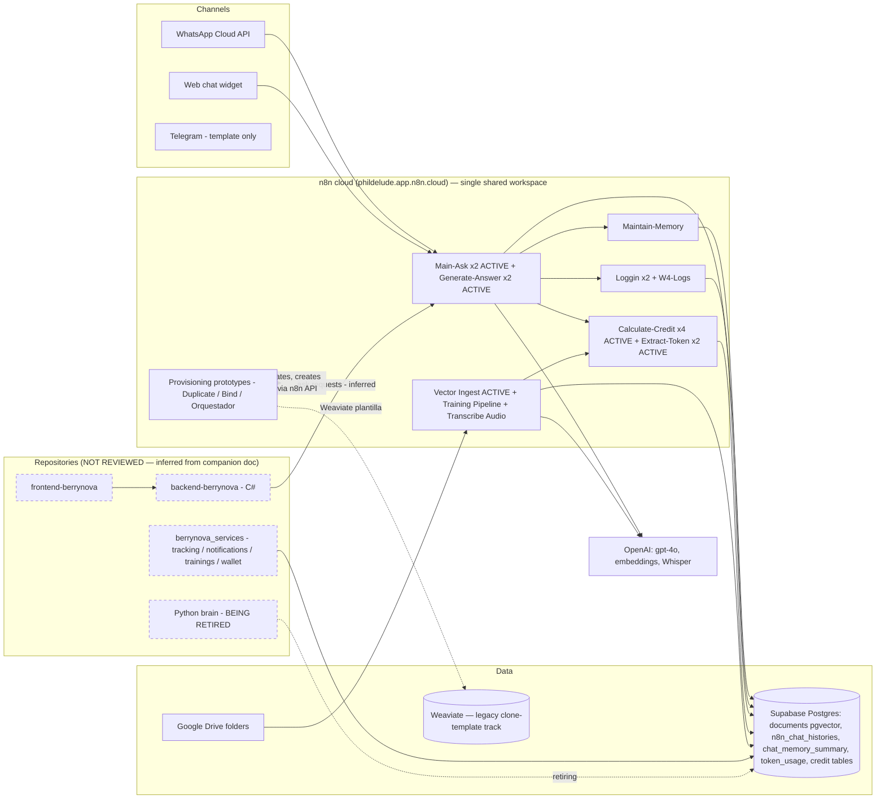
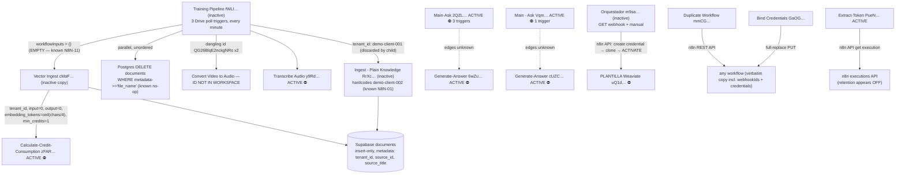
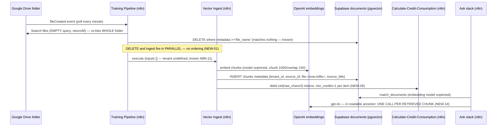

# Berry Nova — Focused Technical Review (non-security)

**Date:** 2026-07-06 · **Reviewer:** Claude (automated deep review, read-only)
**Targets:** `CodeBerry-Solutions/backend-berrynova`, `CodeBerry-Solutions/frontend-berrynova`, `CodeBerry-Solutions/berrynova_services`, and the connected n8n workspace (`phildelude.app.n8n.cloud`)
**Companion document honored:** "Berry Nova — Known findings (non-security)" — every item in it is treated as known and is **not** re-reported; findings below are net-new or explicitly-labeled *extensions* with a stated delta.

---

## 1. Executive summary

**What the system appears to do.** Berry Nova is a multi-tenant AI assistant product: tenants get a RAG-grounded chatbot (WhatsApp / web chat / Telegram channels), fed by a knowledge-ingestion pipeline (Google Drive documents, audio/video transcription, web scraping, YouTube), with usage metered into a credit/wallet system and subscriptions/payments handled by C# services. An n8n cloud workspace is the confirmed go-forward middleware for the AI brain (RAG ask/answer, ingestion/training, chat memory, token metering, and per-tenant provisioning); a Python brain is being retired.

**Access reality (read this first).** The three GitHub repositories were **not reachable from this session**: the session is anchored to the `codeberrysolutions` GitHub owner, cross-owner `add_repo` is unsupported, the GitHub connector is scoped to `Appius-PM-Agent` only, and the repos are private (unauthenticated access 404s). **The repository portion of this review is therefore not performed** — nothing about the repos below is inferred beyond what the companion document itself states. The n8n workspace *was* reviewed, but with a second hard limit: n8n exposes workflow definitions to the MCP connector per-workflow (`availableInMCP` flag), and **most ACTIVE production workflows are not enabled** — 14 of 62 workflow definitions were fully retrieved; the live Main-Ask / Generate-Answer / Loggin / active Maintain-Memory / active Vector Ingest / all four Calculate-Credit workflows could not be read. Additionally, **zero execution history is retained anywhere in the workspace**, so no runtime behavior could be confirmed. Coverage specifics are in §13.

**Apparent maturity.**
- `backend-berrynova`, `frontend-berrynova`, `berrynova_services`: **unknown — not reviewed** (no access).
- n8n layer: **prototype-grade organization carrying production traffic.** 62 workflows, 21 active, zero tags, no dev/prod separation, five duplicated sub-workflow pairs *both active*, four Main-Ask variants (two active with live triggers), ~30% scratch/template dead weight, production credentials duplicated across personal projects, and three parallel non-operational tenant-provisioning prototypes.

**Five most important non-security risks (this review, net-new):**
1. **Token metering may be silently dead or debiting estimates** (NEW-05, NEW-06): the readable Extract-Token workflow persists nothing, reads its parent execution mid-flight from an API whose execution retention appears to be off, silently substitutes token *estimates* for actuals, and the embedding meter bills `ceil(chars/4)` of pre-chunk raw text — not what is actually embedded.
2. **The RAG corpus has no document identity and no safe re-train path** (NEW-01..04): `source_id` is timestamped per run so no purge can ever match prior chunks; the purge that exists runs *in parallel* with the insert (so even the planned IA-777 filter fix would produce a nondeterministic self-deleting ingest); every single-file Drive event re-ingests the *entire folder*; and DOCX/office files fall through to a raw-binary loader that embeds ZIP bytes as garbage — billed and retrievable.
3. **Two complete active ask/billing stacks coexist**, with duplicated active sub-workflow pairs and concrete evidence of post-clone divergence (NEW-07): fixes land in one copy; a user message routed through both channels would be answered and debited twice; which stack is canonical is undocumented.
4. **Clone-per-tenant provisioning with no propagation mechanism** (NEW-09, NEW-10): tenants are (planned to be) onboarded by duplicating workflows and binding per-tenant credentials; nothing links clones to templates, template fixes strand every existing tenant, provisioning has no idempotency or rollback, and a silent guard gap can produce clones that ingest without tenant attribution.
5. **No operational safety net in the layer that is becoming the brain**: zero execution retention, no error workflows, no `onError`/retry on any read node, no environment separation, no tests of any n8n behavior anywhere (and n8n behavior is verified nowhere else either, per the companion document).

**Fit for current use / production readiness / scale.** The n8n layer works as a demo and for a small number of pilot tenants under close human supervision; it is **not production-ready as the system's middleware** in its current form: correctness of billing is unverifiable (and structurally doubtful), re-training corrupts rather than replaces the corpus, and the duplication model makes every fix a multi-copy manual operation. It cannot scale safely in tenants (clone sprawl × no propagation), in corpus size (folder-rescan-per-file is quadratic in cost), or in traffic (unmetered/mis-metered spend). The repositories' readiness could not be assessed.

**Most important immediate action.** Establish ground truth on the live ask/billing path: enable MCP/API read access (or export JSON) for the ~20 active workflows, turn on execution saving, and determine which of the two active stacks is canonical — then deactivate the other. Nothing else can be safely fixed while two divergent live stacks exist and executions are invisible.

**Most important architectural action (n8n-middleware direction).** Adopt "tenant as data, workflow as code": one canonical, parameterized workflow set (single ask stack, single ingest stack, single metering sub-workflow) driven by a tenant registry, with workflow JSON exported to git and deployed to a separate production n8n project/instance — and move the credit *ledger* write behind a single idempotent service API (the C# wallet) instead of letting n8n write billing tables directly. Retiring Python collapses the Python/C# duplication, but **duplication has already re-emerged inside n8n itself**, and the Weaviate clone-template track means the store split-brain survives Python's retirement unless that track is explicitly killed (§4.4).

**Largest area of uncertainty.** The three repositories (0% reviewed) and the active n8n production stack (definitions unreadable — findings on active workflows are extrapolated from their retrievable inactive twins and labeled as such). Zero execution history means *no* finding could be runtime-confirmed.

**Overall risk rating (n8n layer, non-security): HIGH** — driven by billing integrity, corpus integrity, and change-management structure rather than by any single catastrophic defect.

---

## 2. Repository and workflow inventory

### 2.1 Repositories

| Repo | Reviewed | Notes |
|---|---|---|
| backend-berrynova | **No — access denied** | Private; session cannot reach the `CodeBerry-Solutions` owner (see §13) |
| frontend-berrynova | **No — access denied** | Same |
| berrynova_services | **No — access denied** | Same |

No statements in this report about languages, frameworks, builds, tests, migrations, or CI of these repos are made from inspection. Where the companion document describes them (C# services, Python worker, Supabase Postgres, Stripe, Mailjet, MassTransit-style consumers, pm2 deploys), that is quoted context, not verified.

### 2.2 n8n workspace inventory

Single n8n Cloud instance `phildelude.app.n8n.cloud`. 62 workflows, 21 active, 0 tags, 0 data tables, 2 visible projects (team "BerryNova", personal "Philip M Delude"; a third personal project — Jose Luis Correa Godefoy — is visible only as a credential home and may contain workflows invisible to this review). 32 credentials (names/types only inspected). **Workflow definitions were retrievable: yes, confirmed** — 14 full definitions were retrieved and read node-by-node; the rest are blocked by the per-workflow `availableInMCP` flag (full lists in §13).

**Production families (by name/lineage; ✅ = full definition read, ⛔ = blocked):**

| Family | Workflows (id, active?) |
|---|---|
| Ask / answer | ⛔ Main-Ask `2QZLXI9gEJosDm3d` **ACTIVE, 3 triggers**; ⛔ Main - Ask `VqmMlELvgq8uVXvT` **ACTIVE, 1 trigger**; ⛔ Main-Ask `vICBPaXTkkYWabKY` (inactive); ⛔ Main-Ask copy `qf99D0ccodhxCTo1` (inactive, newest edit in family); ⛔ Generate-Answer `6wZupSeAs74HDx0s` **ACTIVE**; ⛔ Generate-Answer `cUZCu0db6MOVth2h` **ACTIVE**; ⛔ W2 - Generate RAG Answer `wog5Hz97eijBCLLJ` **ACTIVE**; ⛔ Enmanuel-Ask `UdoBOmU0zCtogNWr` **ACTIVE**; ✅ CBS RAG — Ask `tti62FYYs9xkPRE6` (inactive ancestor; public chat trigger); ⛔ get-embeddings `uaJCUNsYAyboufik` **ACTIVE** |
| Memory | ⛔ Maintain-Memory `Wwt0tHF7N3du32GM` **ACTIVE**; ✅ Maintain-Memory `5p5Kn2YB2E6dAkpS` (inactive twin, fully read) |
| Logging | ⛔ Loggin `Na8fMaywTOM31uLP` **ACTIVE**; ⛔ Loggin `3qdr0WLgMKFhrHHO` **ACTIVE**; ⛔ W4 - Logs `r2G2YNbFsYKHj8N5` **ACTIVE** |
| Credits / metering | ⛔ Calculate-Credit-Consumption `TXFzgfqguTyJxUxy` **ACTIVE** + `zFARKUpZhLQFvUPk` **ACTIVE**; ⛔ Calculate-Credits-Workflow `pk1QQrNB8WnFhBDS` **ACTIVE** + `1x8RlaEZjinmqCdQ` **ACTIVE**; ⛔ Extract-Token-Chat-Completion `pdCkPbu8wSpuxj2N` **ACTIVE**; ✅ Extract-Token-Chat-Completion `PueN3scDC2IhHSFp` **ACTIVE** (fully read) |
| Ingestion / training | ⛔ Main-Training `tG0ExU9N3a4VA8MH`; ✅ CBS RAG — Training Pipeline `fWLldKcDc7V47yns` (inactive); ⛔ CBS RAG — Vector Ingest (VS) `DK0JVEqKAbfaBY47` **ACTIVE**; ✅ Vector Ingest (VS) `cMaFNGoo4doQG3jf` (inactive twin, fully read); ✅ CBS RAG — TEXT CONVERTER `pzzyMucefLDu43Rq` **ACTIVE** (both published & draft versions read); ⛔ TEXT CONVERTER `fpsA5TwQUlKcfi5Z`; ⛔ ingest-workflow `p6xsMbhLbrywYNVG` **ACTIVE**; ⛔ Transcribe Audio `y9RdSZoVCPVVI8P8` **ACTIVE**; ✅ Ingest - Plain Knowledge `RrXc4CD4OqltEzKx`; ⛔ Ingest Web Scrapping / YouTube / Image ×2 / Convert Video to Audio / Drive Generic (all inactive); ✅ Text/Plain Document Training `AbWkVJD4vS6ySYvI` (inactive) |
| Tenant provisioning | ✅ Orquestador - Clonar ingesta Drive por tenant `m9saGWLWmpwae0tE`; ✅ Duplicate Workflow (REST) `mmCGBfyb89S4KPAo`; ✅ Bind WhatsApp & Drive Credentials `GaOGKael5p4q96Qp`; ✅ Create WhatsApp Credential `hpEQSsrpveCPPqvA`; ✅ Create Google Drive Credential `T0Zt9USiCtB1LvmO`; ✅ Dynamic WhatsApp Validation Suite `KFy9XpRm2459Ap40`; ⛔ Jose-Duplicate-Workflow `VXzElrjSDzLLiexo`; ⛔ PLANTILLA - Ingesta Drive - Weaviate `uQ1dmTZZcBRuXQsg` (the template the Orquestador clones) |
| Templates / scratch | ⛔ 6 × "MT …" multi-tenant templates, 5 × imported RAG templates, 5 × "My workflow…" scratch, Enmanuel - Training — all inactive |

---

## 3. System and architecture map

### 3.1 High-level architecture (n8n layer verified; repo boxes inferred from the companion document — labeled)

### 3.2 Workflow dependency graph (verified edges only; ⛔ = definition unreadable so edges unknown)

### 3.3 Data flow across the repo/n8n boundary — ingestion → retrieval (verified for the readable stack)

### 3.4 Cross-system observations

- **Shared database, no schema owner.** Supabase Postgres is written by n8n (documents, chat histories, summaries, token_usage, credit debits via the unreadable Calculate workflows), by the C# services, and (until retirement) the Python worker — the companion doc's SYS-04 "distributed monolith" holds; nothing reviewed here changes it, and n8n adds writers with no migrations or DDL ownership at all.
- **Duplicated functionality**: beyond the known Python/C#/n8n triplication, duplication now exists *within* n8n: five active duplicate sub-workflow pairs, four Main-Ask variants, two logging lineages (Loggin ×2 + W4-Logs), two memory implementations (Postgres summary machinery vs in-RAM `memoryBufferWindow`), three provisioning prototypes, and two vector-store tracks (Supabase `documents` vs the Weaviate plantilla).
- **Single points of failure**: one n8n cloud workspace is simultaneously prod, dev, and playground; one Supabase instance backs everything; production credentials live in personal projects (two "Postgres account 2" copies, personal OpenAI/Supabase creds backing active workflows).
- **Where a change in one place breaks another** (all evidenced): Ask prompt wording ↔ Maintain-Memory's regex (NEW-11); TEXT CONVERTER draft-vs-published output contract ↔ its callers (NEW-08); template fixes ↔ tenant clones (NEW-09); metadata keys written by ingest ↔ purge filters and Ask citations (known N8N-12 + NEW-02); duplicate stacks ↔ any single-copy fix (NEW-07).

---

## 4. Intended behavior of major workflows (Phase 3)

Only n8n-side flows could be traced; registration/login, subscriptions, and payment confirmation live in the unreviewed repos.

| Flow | Objective | Components | Data created/modified | Success | Likely failure modes | Ambiguity |
|---|---|---|---|---|---|---|
| **Ask / chat answer** | Answer a tenant user's question grounded in their corpus | Channel → Main-Ask (⛔) → Generate-Answer (⛔) → get-embeddings (⛔) → Supabase `match_documents` → gpt-4o; logs via Loggin; memory via `n8n_chat_histories` | chat history rows, logs, credit debits | Grounded answer within credit limits | Readable ancestor answers once **per retrieved chunk** (NEW-14); two active stacks may both answer (NEW-07); error string saved as a turn (known) | Which stack/channel binding is production |
| **Multi-turn memory** | Keep context while bounding tokens | Maintain-Memory: load history → gpt-4o summarize oldest turns → upsert `chat_memory_summary` → delete summarized rows | summary upsert; history delete | Old turns folded into rolling summary | Regex-coupled to prompt wording (NEW-11); concurrent overwrite + prune loses memory (NEW-12); failure loop grows prompt unboundedly (NEW-13) | Whether active twin matches readable copy |
| **RAG ingestion / training** | Sync Drive folders into pgvector corpus per tenant | Drive triggers → Training Pipeline → TEXT CONVERTER / Transcribe Audio → Vector Ingest → Supabase `documents`; credits via Calculate-Credit | vector chunks + metadata; credit debits; token_usage (intended) | New/changed file retrievable, old version replaced | Purge no-op (known) + purge races insert (NEW-01) + unstable source_id (NEW-02) + whole-folder re-ingest (NEW-03) + DOCX→binary garbage (NEW-04) | Which workflow actually calls the ACTIVE Vector Ingest |
| **Usage metering** | Convert LLM/embedding usage to credit debits | Extract-Token (execution self-fetch) + Calculate-Credit-* (⛔, formulas unreadable) → Supabase | token_usage rows (promised), credit balance updates | Debits match actual spend | Extraction persists nothing / estimates substituted / first-item-only (NEW-05); embedding meter is chars/4 pre-chunk with per-item minimum (NEW-06) | Formulas/price maps unreadable; which copy each stack calls |
| **Tenant provisioning** | Onboard a tenant: credentials + cloned ingest/chat workflows | Orquestador / Duplicate / Bind / credential forms (all inactive prototypes) | n8n credentials, cloned workflows (activated by Orquestador) | Tenant's Drive folder ingesting under their tenant_id | Partial provisioning w/o rollback; silent tenant_id skip; duplicate active clones; webhook path collisions (NEW-09/10, NEW-19/20) | Whether real onboarding is manual today (evidence says yes) |
| **Logging / tracking** | Persist chat/ops logs | Loggin ×2 + W4-Logs (all ⛔) | log tables | — | Unreviewable | Why three logging workflows are active |

---

## 5. Commands and tools executed

All read-only. No workflow was executed, triggered, activated, deactivated, modified, or created; no credential or setting was touched; no repository file was modified (this report is committed to the dedicated review branch of `Appius-PM-Agent` only).

| Action | Result |
|---|---|
| `add_repo` for the 3 CodeBerry-Solutions repos | Denied — cross-owner adds unsupported in this session type |
| GitHub MCP `get_file_contents` on backend-berrynova | Denied — session scoped to `codeberrysolutions/Appius-PM-Agent` |
| Unauthenticated `git ls-remote` / web fetch of the repos | 404 / auth prompt — repos private |
| n8n `search_workflows` (limit 200) | 62 workflows returned (inventory §2.2) |
| n8n `get_workflow_details` on 33 workflow ids | 14 full definitions returned; 19 rejected with "Workflow is not available in MCP" |
| n8n `search_executions` (global + per-workflow) | **0 executions everywhere**; blocked entirely for MCP-disabled workflows |
| n8n `list_credentials`, `list_tags`, `search_projects`, `search_folders`, `search_data_tables` | 32 credentials (names/types), 0 tags, 2 visible projects, 14 folders, 0 data tables |

**Test and build results:** none run — the repositories were inaccessible, and n8n has no test surface. No behavior implemented in n8n is verified by any test reachable in this review.

---

## 6. Findings

Severity ordering. Every finding was checked against the companion document; *extension* findings state their delta explicitly. Verification statuses reflect the read-only constraint: nothing could be runtime-reproduced (no execution history; triggering forbidden).

> **Scope note:** several observations touching authentication of webhooks and tenant *retrieval* filtering were deliberately not investigated or written up here — they are security-class and belong to the separate track. Where a tenancy defect is reported below, it is framed strictly as a data-attribution/data-integrity defect on the write path.

### 6.1 High

---

**[NEW-01] — Corpus purge and vector insert run in parallel; the planned IA-777 fix would create a nondeterministic self-deleting ingest**
**Target:** n8n · **Severity:** High · **Category:** correctness / data-integrity · **Verification status:** Verified (static, full definition) · **Confidence:** High · **Not already known:** confirmed — N8N-12/IA-777 covers the *filter key* being wrong; the missing *ordering edge* is new and blocks that fix.
**Evidence:** `CBS RAG — Training Pipeline` (`fWLldKcDc7V47yns`), connections: `"Edit Fields": {"main": [[{"node":"Execute a SQL query"}, {"node":"Call 'Vector Ingest (VS)'"}]]}` — the Postgres `DELETE FROM documents WHERE metadata->>'tenant_id'=$1 AND metadata->>'file_name'=$2` and the ingest sub-workflow call fire from the same output with no sequencing.
**What is happening:** delete-then-insert was intended; as wired, both branches run concurrently. Today the DELETE matches nothing (known), which *masks* the race. The moment the filter key is corrected, the DELETE can execute after the new chunks are inserted and wipe them — timing-dependent per execution.
**Why it matters:** the flagship known bug's fix, as ticketed, will convert a silent no-op into intermittent silent loss of freshly-ingested documents.
**Trigger:** any retrain after the IA-777 filter fix lands, whenever the DELETE branch completes after the insert.
**Affected scope:** all tenants' corpora; both training copies presumably (Main-Training `tG0ExU9N3a4VA8MH` unreadable).
**Suggested remediation:** sequence DELETE → ingest explicitly (chain the nodes), or better, move to an upsert keyed on a deterministic document identity (see NEW-02).
**Validation:** after fix, retrain the same file twice and assert chunk count is stable and chunks' timestamps are from the last run.
**Effort:** XS (wiring) but couple with NEW-02 (M) · **Change risk:** Low · **Dependencies:** must land *with or before* the IA-777 filter fix; verify same wiring in Main-Training once readable.

---

**[NEW-02] — `source_id` is timestamped per run: documents have no stable identity, so no purge/upsert can ever match prior chunks**
**Target:** n8n · **Severity:** High · **Category:** data-integrity · **Verification status:** Verified (static) · **Confidence:** High · **Not already known:** confirmed — N8N-12 says the purge filters on a key never written; this finding is that even a corrected filter has nothing stable to match on.
**Evidence:** Training Pipeline `Edit Fields`: `source_id = "={{ $binary.data.fileName }}-{{ $now.toMillis() }}"`. Vector Ingest writes metadata keys `tenant_id`, `source_id`, `source_title` only (verbatim from `cMaFNGoo4doQG3jf` document loader; no `file_name`, `drive_id`, or `mime_type`).
**What is happening:** every ingest of the same file mints a new `source_id`. The only durable keys are `tenant_id` and `source_title` (a display name, not unique).
**Why it matters:** idempotent re-training is structurally impossible; the corpus-bleed class of bugs cannot be closed by fixing the delete filter alone. Retry-driven duplicate chunks are also undetectable.
**Trigger:** any re-ingest, retry, or the folder-rescan behavior of NEW-03.
**Affected scope:** entire Supabase `documents` corpus, all tenants.
**Suggested remediation:** make document identity deterministic — `source_id = drive file id` (available from the trigger payload) — write it into chunk metadata, and purge/upsert on `(tenant_id, source_id)`.
**Validation:** ingest a file twice; `SELECT count(*) FROM documents WHERE metadata->>'source_id' = :driveId` must be constant.
**Effort:** S–M (touch Training Pipeline + Vector Ingest active copy + backfill/clean existing corpus) · **Change risk:** Medium (existing rows lack the key → one-time corpus rebuild or backfill needed) · **Dependencies:** NEW-01 sequencing; access to the ACTIVE Vector Ingest definition.

---

**[NEW-03] — Every single-file Drive event re-ingests the entire folder (unbounded duplicate chunks and embedding spend)**
**Target:** n8n · **Severity:** High · **Category:** performance-reliability-cost / data-integrity · **Verification status:** Verified (static) · **Confidence:** High · **Not already known:** confirmed (not in companion doc).
**Evidence:** Training Pipeline `Google Drive Trigger2` (fileCreated, everyMinute) → `Search files and folders` with `"queryString": "="` (empty) and `"returnAll": true` over the whole `documents` folder; every result is downloaded and pushed through ingest.
**What is happening:** one new file causes N downloads, N conversions, N embedding passes, N credit debits — for all N files in the folder — and with insert-only ingestion (known) each pass duplicates every prior document's chunks again.
**Why it matters:** corpus quality degrades (retrieval increasingly dominated by duplicates), and OpenAI embedding spend + tenant debits grow quadratically with corpus size over time.
**Trigger:** any file added to a watched folder.
**Affected scope:** all Drive-ingested tenants; cost on both the platform (OpenAI bill) and tenant (credits) side.
**Suggested remediation:** process only the triggering file (the trigger event already carries it), or diff against ingested `source_id`s; keep folder rescans as an explicit manual "full retrain" path that purges first.
**Validation:** add one file to a folder of 10; assert exactly one document's chunks change and one debit occurs.
**Effort:** XS–S · **Change risk:** Low · **Dependencies:** none; verify same pattern in unreadable Main-Training / ingest-workflow.

---

**[NEW-04] — DOCX (and all non-PDF/XLSX/audio/image types) fall through to a raw-binary loader: office files are embedded as ZIP-byte garbage, billed, and retrievable**
**Target:** n8n · **Severity:** High · **Category:** correctness / data-integrity / cost · **Verification status:** Verified (static) · **Confidence:** High (inactive copy); Medium that the ACTIVE Vector Ingest matches · **Not already known:** confirmed.
**Evidence:** Training Pipeline `Download file1` sets Google-Docs export to DOCX (`docsToFormat: application/vnd.openxmlformats-…wordprocessingml.document`). Vector Ingest `Route by File Type` matches only PDF / XLSX / `audio/*` / `image/*`, with `fallbackOutput: "extra"` routed **directly to `Prepare Ingest`** (default data loader in binary mode). The DOCX-extraction logic exists only in TEXT CONVERTER (`pzzyMucefLDu43Rq`), which Vector Ingest never calls.
**What is happening:** every Google Doc — the most common Drive content type — arrives as DOCX and is chunked/embedded as raw compressed bytes. Same for PPTX, CSV, video files that reach this path.
**Why it matters:** silent corpus pollution (garbage chunks compete in similarity search), paid embeddings of noise, and tenant debits for it; users experience "the bot doesn't know my documents" with no error anywhere.
**Trigger:** ingesting any Google Doc / DOCX via the documents folder.
**Affected scope:** all tenants using Drive document ingestion.
**Suggested remediation:** route office types through TEXT CONVERTER (and reconcile its output contract first — NEW-08); make the fallback branch *fail loudly* instead of ingesting unknown binary types.
**Validation:** ingest a Google Doc; inspect stored `content` of its chunks for natural language; add an assertion/alert on non-text ratios.
**Effort:** S · **Change risk:** Medium (touches the active ingest path) · **Dependencies:** NEW-08 contract fix; read access to ACTIVE Vector Ingest.

---

**[NEW-05] — Token-usage extraction cannot work as designed: mid-flight execution self-fetch, retention off, estimates silently substituted, first-item-only reads, and no persistence in the readable copy** *(extension of N8N-10 — delta stated)*
**Target:** n8n · **Severity:** High · **Category:** correctness / data-integrity (billing) · **Verification status:** Strongly supported (static + zero-retention observation; runtime confirmation impossible read-only) · **Confidence:** High on structure, Medium on runtime behavior · **Not already known:** N8N-10 covers "doesn't write the token_usage its description promises". **New here:** the *mechanism* is broken in four additional independent ways, so fixing the missing insert alone will not make metering correct.
**Evidence:** `Extract-Token-Chat-Completion` (`PueN3scDC2IhHSFp`, ACTIVE): 3 nodes — `executeWorkflowTrigger(execution_id)` → n8n-API node `Get execution data` (`requestOptions: {}`, no timeout/retry) → Set node whose output connects to nothing (`"main":[[]]`). Extraction JMESPath (verbatim): `…{model: …generationInfo.model_name || inputOverride…options.model_name || …options.model, tokenUsage: …tokenUsage || tokenUsageEstimate}` reading only `ai_languageModel[0][0]`.
**What is happening:** (a) it fetches its **parent's own execution record by id while the parent is still running** — n8n persists `runData` at completion, so the fetch returns partial/empty data; (b) workspace execution saving appears **off** (0 executions retained anywhere), in which case the fetch can never return usage; (c) `|| tokenUsageEstimate` silently substitutes estimates for actuals with no flag; (d) only the first item of the first run of each LLM node is read — multi-item runs undercount; (e) results go nowhere.
**Why it matters:** the revenue-integrity chain (tokens → credits) is unverifiable and structurally likely to record nothing or estimates. Whether the *other* active copy (`pdCkPbu8wSpuxj2N`, unreadable) works is unknown.
**Trigger:** every metered chat completion.
**Affected scope:** all chat billing.
**Suggested remediation:** stop re-fetching executions; pass the LLM node's token usage forward in-band (it is available on the model node output), tag estimated vs actual, aggregate across items, and persist in the same workflow. Turn execution saving on regardless (observability).
**Validation:** run one chat turn in a test tenant; assert a `token_usage` row exists whose counts match the OpenAI dashboard for that call.
**Effort:** S–M · **Change risk:** Medium (billing path) · **Dependencies:** decide which Extract-Token copy is canonical (NEW-07); execution-saving setting.

---

**[NEW-06] — Embedding metering bills `ceil(chars/4)` of the raw pre-chunk text, plus a per-item 1-credit minimum: debits are systematically wrong in both directions**
**Target:** n8n · **Severity:** High · **Category:** correctness (financial metering) · **Verification status:** Verified in the readable copy; Plausible-but-unverified for the ACTIVE clone (`DK0JVEqKAbfaBY47` unreadable) · **Confidence:** High / Medium respectively · **Not already known:** confirmed — CR-08 (rounding) and N8N-15 (vision/Whisper unmetered) are different defects.
**Evidence:** `cMaFNGoo4doQG3jf` Code node `Count Tokens (heuristic)` (verbatim): `const text = buffer.toString('utf8'); const embedding_tokens = Math.ceil(text.length / 4);` — computed on the whole file *before* chunking; the splitter then embeds chunks with `chunkOverlap: 150` (overlap text embedded and paid to OpenAI but never billed). Caller `Calculate AI embedding credits` executes `zFARKUpZhLQFvUPk` **per item** with `min_credits: 1`.
**What is happening:** three unit errors (heuristic vs tokenizer; pre-chunk vs post-chunk volume; UTF-16 `.length` of decoded bytes — including garbage counts for binary fallthrough files, NEW-04) plus a per-item minimum that charges N credits for N trivial items. The meter also runs in parallel with the vector insert, so tenants are debited even when the insert fails.
**Why it matters:** platform under-recovers on large documents (overlap unbilled), over-charges many small items, bills for garbage and for failed ingests — a metering model that cannot be reconciled against the OpenAI invoice.
**Trigger:** every embedding ingest.
**Affected scope:** all ingest billing, all tenants.
**Suggested remediation:** meter from the embeddings response's actual usage (or a real tokenizer over the chunks), aggregate per document before applying any minimum, and debit only after successful insert.
**Validation:** ingest a known document; compare debit vs OpenAI-reported embedding tokens.
**Effort:** S–M · **Change risk:** Medium · **Dependencies:** readable ACTIVE Vector Ingest + Calculate-Credit formulas (currently blocked).

---

**[NEW-07] — Two complete active ask/billing stacks coexist, with five duplicated active sub-workflow pairs and concrete post-clone divergence**
**Target:** n8n · **Severity:** High · **Category:** architecture / correctness · **Verification status:** Strongly supported (workspace metadata + timestamps; definitions of the pairs unreadable) · **Confidence:** High that the duplication exists; Medium on double-processing/divergence details · **Not already known:** confirmed — SYS-02/CR-03 concern cross-*language* duplication; this is duplication *within* n8n.
**Evidence:** Both-ACTIVE pairs: Generate-Answer (`6wZupSeAs74HDx0s`+`cUZCu0db6MOVth2h`), Loggin (`Na8fMaywTOM31uLP`+`3qdr0WLgMKFhrHHO`) plus W4-Logs, Extract-Token (`pdCkPbu8wSpuxj2N`+`PueN3scDC2IhHSFp`), Calculate-Credit-Consumption (`TXFzgfqguTyJxUxy`+`zFARKUpZhLQFvUPk`), Calculate-Credits-Workflow (`pk1QQrNB8WnFhBDS`+`1x8RlaEZjinmqCdQ`). Ask entry points: `2QZLXI9gEJosDm3d` ACTIVE (3 triggers) and `VqmMlELvgq8uVXvT` ACTIVE (1 trigger); plus `Main-Ask copy` created 2026-06-12 — *newer than the active Main-Ask's last update*, suggesting live edits happening on an undeployed copy. Creation timestamps show a batch clone on 2026-06-03 12:50–12:58; `TXFzgfqguTyJxUxy` was edited again 06-05 while its twin `zFARKUpZhLQFvUPk` was last edited 06-02 — the pair is almost certainly no longer identical.
**What is happening:** an old stack and a 06-03 cloned stack are both live; callers reference copies by workflow-id, so which logic (and which price table) serves a request depends on which stack the channel hits. The known store split-brain has an intra-n8n sibling: a *logic* split-brain.
**Why it matters:** fixes land in one copy; charges are non-deterministic across stacks; if any channel is registered to both ask entry points, a message is answered and debited twice; nobody can say which behavior is "the product".
**Trigger:** ongoing — every request.
**Affected scope:** entire chat + billing path.
**Suggested remediation:** declare one canonical stack, diff the pairs, port needed changes, deactivate + archive the rest; adopt a rule that sub-workflows are singletons referenced by id from a documented registry.
**Validation:** after consolidation, enumerate active workflows: no duplicate names; a test message through each channel produces exactly one answer, one log row, one debit.
**Effort:** M (diffing blocked pairs requires read access first) · **Change risk:** Medium–High (touching live routing) · **Dependencies:** MCP/API read access to the blocked definitions; channel-binding inventory (which webhook is registered where — likely in the unreviewed backend).

---

**[NEW-08] — TEXT CONVERTER: the published version lacks the output-normalization node entirely — the published↔draft divergence breaks the contract for ALL file types, not just EXCEL** *(extension of N8N-08 — delta stated)*
**Target:** n8n · **Severity:** High · **Category:** correctness · **Verification status:** Verified (both versions retrieved verbatim) · **Confidence:** High · **Not already known:** N8N-08 covers "published ≠ draft; EXCEL branch throws". **New here:** the draft's `Markdown to File` node (binary output, `sourceProperty: "markdown"`, filename from `source_id`) does not exist in the published `activeVersion`; published connections end at `Map PDF to Markdown` / `Extract DOCX Text` / `Code 2`, returning per-branch JSON instead of a binary file.
**What is happening:** any caller built against the draft contract (`$binary.data`) receives nothing usable from the *published* workflow for every branch, PDF and DOCX included.
**Why it matters:** the document-conversion sub-workflow — the piece NEW-04's fix depends on — currently has two incompatible personalities depending on how it is invoked, and no readable workflow calls it at all (it may be entirely orphaned while ACTIVE).
**Trigger:** any invocation of the published version by a draft-contract caller.
**Affected scope:** document ingestion for non-PDF types once wired in.
**Suggested remediation:** define the contract (recommend `{ markdown: string }` JSON), make all branches conform, publish, and delete the stale version; add a caller.
**Validation:** invoke with a PDF, DOCX, XLSX fixture; assert identical output shape.
**Effort:** S · **Change risk:** Low (currently likely orphaned) · **Dependencies:** NEW-04 routing work.

---

**[NEW-09] — Clone-per-tenant provisioning has no template→clone linkage and no fix-propagation mechanism; at N tenants every template fix is O(N) manual surgery**
**Target:** n8n · **Severity:** High · **Category:** architecture · **Verification status:** Verified (all provisioning definitions read; corroborated by workspace state) · **Confidence:** High · **Not already known:** confirmed.
**Evidence:** `Duplicate Workflow` copies nodes verbatim (including credentials refs and `webhookId`s) via one POST; `Bind Credentials` rewrites only credential refs via full-replace PUT; `Orquestador` clones the Weaviate plantilla, creates the credential first, activates last. No tags (0 in workspace), no registry (0 data tables), no naming convention, no template-version marker on clones; nothing links a clone to its template. Three overlapping implementations exist (Duplicate+Bind in English/HTTP-auth, Jose-Duplicate-Workflow, Orquestador in Spanish/n8n-API-node), all inactive with zero recorded runs — actual onboarding is evidently manual UI cloning.
**What is happening:** the chosen multi-tenancy model multiplies every workflow bug across the fleet at onboarding time and provides no way to heal the fleet afterward.
**Why it matters:** this is the central architectural risk of the n8n-middleware direction. Every finding above (metering, ingestion identity, converter contract) gets frozen into per-tenant copies the moment tenants are cloned; the cost of fixing anything grows linearly with tenant count, and drift makes tenant behavior diverge silently.
**Trigger:** onboarding tenant #2 onward.
**Affected scope:** the entire go-forward operating model.
**Suggested remediation:** invert the model — see §8 target architecture: parameterized shared workflows + tenant registry; clone only where n8n's static-credential binding forces it (WhatsApp/Drive), and for those, generate clones from source-controlled JSON so "re-provision from template vN" is the propagation mechanism; record tenant→workflow→credential in a registry table.
**Validation:** fix a template bug, run the propagation path, verify all tenant clones updated (diff clone JSON vs template).
**Effort:** L–XL (this is the milestone-3 centerpiece) · **Change risk:** Medium (greenfield harness around existing flows) · **Dependencies:** product decision on tenant count trajectory; n8n API automation; git repo for workflow JSON.

---

**[NEW-10] — Orquestador provisioning is non-idempotent, creates credentials before validating, activates unconditionally, and can silently produce clones whose ingested records carry the template's (or no) tenant attribution**
**Target:** n8n · **Severity:** High · **Category:** correctness / data-integrity · **Verification status:** Verified (static; template itself unreadable) · **Confidence:** High on the code paths; Medium on the template-dependent impact · **Not already known:** confirmed.
**Evidence:** `m9saGWLWmpwae0tE`: config hardcoded in a Code node (placeholder `clientId: 'TU_CLIENT_ID…'`, pasted OAuth token data, `tenantId: 'tenant_cliente_x'`); sequence = create credential → fetch template → build → create workflow → **activate**, with throws only for missing Drive nodes; `tenantSet` is counted but never asserted (`const e = mv.find(m => m.name === 'tenant_id'); if (e) {…}`) so a template whose loader lacks that metadata entry yields a clone that ingests **without tenant attribution**, silently. Re-running creates a second credential and a second ACTIVE clone watching the same folder (double ingestion). Residue already visible: three credentials named "Cliente X - Google Drive", two of identical type — classic re-run orphans. (The trigger being an open GET webhook is noted and left to the security track.)
**Why it matters:** the provisioning path can corrupt tenant data attribution and double-ingest, and failed runs leave orphaned credentials with no rollback and no error handling.
**Trigger:** any provisioning run/re-run; any template edit that renames the tenant metadata entry.
**Affected scope:** every tenant provisioned via this path; the shared vector store's attribution integrity.
**Suggested remediation:** validate template shape *before* creating anything; assert `tenantSet > 0`; make runs idempotent per tenant (check registry first); activate only after verification; delete created credential on failure.
**Validation:** run against a test template with the metadata entry removed → must fail loudly; re-run for the same tenant → must no-op.
**Effort:** S–M · **Change risk:** Low (inactive prototype today) · **Dependencies:** NEW-09 registry; readable plantilla (`uQ1dmTZZcBRuXQsg`).

### 6.2 Medium

---

**[NEW-11] — Maintain-Memory's summarizer is regex-coupled to the Ask prompt's Spanish wrapper text and JSON-parses AI turns: prompt edits or error turns fold instruction/error text into the durable memory summary**
**Target:** n8n · **Severity:** Medium · **Category:** correctness / maintainability · **Verification status:** Verified in `5p5Kn2YB2E6dAkpS`; Plausible-but-unverified that the ACTIVE twin (`Wwt0tHF7N3du32GM`) matches · **Confidence:** High / Medium · **Not already known:** confirmed — distinct from known prompt findings (N8N-14) and memory findings (N8N-13, CHAT-02): this is a hidden cross-workflow contract.
**Evidence:** `Decide Summarize` Code node: user turns extracted via `content.match(/Pregunta del usuario:\s*([\s\S]*?)\s*\n\nDevuelve/)`; AI turns via `JSON.parse(content)` expecting `{answer}`.
**What is happening:** the memory layer depends on the exact wording of a prompt that exists in multiple diverging live copies (NEW-07), and on assistant turns always being valid JSON — the known "error string saved as a turn" feeds raw error text straight into the rolling summary.
**Why it matters:** silent long-term memory corruption per user; a prompt copy-edit in one stack breaks memory for that stack only — near-impossible to diagnose.
**Suggested remediation:** store clean user/assistant text in `n8n_chat_histories` (strip wrappers at write time) so the summarizer consumes structure, not prose; guard `JSON.parse`.
**Validation:** inspect `chat_memory_summary` rows for wrapper text ("Pregunta del usuario", "Devuelve") and JSON fragments.
**Effort:** S · **Change risk:** Medium (touches history write format) · **Dependencies:** read access to active Ask stack to locate the write site.

---

**[NEW-12] — Maintain-Memory concurrent runs wholesale-overwrite each other's summary and then prune: permanent memory loss, not just duplication** *(extension of CHAT-02 / N8N-13 — delta stated)*
**Target:** n8n · **Severity:** Medium · **Category:** correctness / concurrency · **Verification status:** Strongly supported (static; concurrency not reproducible read-only) · **Confidence:** Medium-High · **Not already known:** CHAT-02 covers a lock race producing *duplicate* memory; N8N-13 covers non-transactional prune. **New here:** the `ON CONFLICT … DO UPDATE SET summary = EXCLUDED.summary` last-writer-wins overwrite discards the other run's merged facts, after which `DELETE … WHERE id <= $2` prunes the turns whose summarization was just overwritten away — unrecoverable loss.
**Evidence:** verbatim SQL in §1 of the memory review: upsert with full replacement + `Prune History: DELETE FROM n8n_chat_histories WHERE session_id = $1 AND id <= $2`; no advisory lock / `SELECT … FOR UPDATE` anywhere; history load has no `LIMIT`.
**Suggested remediation:** per-user advisory lock (`pg_advisory_xact_lock(hash(session_id))`) around load→summarize→upsert→prune, and prune only ids the *committed* summary covered.
**Validation:** fire two concurrent maintenance runs for one user in a test DB; assert no summarized fact disappears.
**Effort:** S · **Change risk:** Low · **Dependencies:** confirm ACTIVE twin's SQL matches.

---

**[NEW-13] — Maintain-Memory failure-amplification loop: unbounded backlog into a single gpt-4o call, `token_estimate` hardcoded to 0, message-count trigger**
**Target:** n8n · **Severity:** Medium · **Category:** performance-reliability-cost · **Verification status:** Verified (static) · **Confidence:** High on code; Medium on the loop occurring in production · **Not already known:** confirmed.
**Evidence:** `MSG_TRIGGER = 10; KEEP_RECENT = 8` (message counts, not tokens); upsert always writes `token_estimate = 0`; `old_messages` slice is unbounded; no `onError`/retry on the LLM node.
**What is happening:** if summarization fails once (e.g., prompt too large), nothing is pruned, the next run's prompt is strictly larger — a one-way ratchet into permanent summarization failure with growing per-attempt gpt-4o cost, invisible because there is no error path.
**Suggested remediation:** cap the summarized slice per run (batch), alert on failure, use a cheaper pinned model (deterministic temperature) for compression.
**Effort:** S · **Change risk:** Low · **Dependencies:** —.

---

**[NEW-14] — Ask lineage: retrieval feeds the agent per-chunk — k retrieved chunks ⇒ k independent gpt-4o agent runs per question, each grounded on ONE chunk, with k assistant turns written into a 10-turn memory buffer**
**Target:** n8n · **Severity:** Medium (High if the pattern propagated to the active stack) · **Category:** correctness / cost · **Verification status:** Verified in `tti62FYYs9xkPRE6` (inactive ancestor); Plausible-but-unverified for the ACTIVE Main-Ask/Generate-Answer (unreadable) · **Confidence:** High / unknown · **Not already known:** confirmed — known #5/#8 concern memory config and non-determinism, not the fan-out.
**Evidence:** Supabase Vector Store in main-flow `load` mode feeding the agent's main input; system message embeds `{{ $json.document.pageContent }}` (single current item); `memoryBufferWindow`, `contextWindowLength: 10`. Also: the prompt cites `metadata.source`, a key **no ingest workflow writes** (they write `source_title`/`source_id`) — citations always empty; and node description drift (says gpt-4o-mini/top-5; configured gpt-4o/default-4, embeddings model unpinned) [also NEW-15/NEW-23].
**Why it matters:** ~4× LLM cost per question, fragmented grounding (each answer sees one chunk), real conversation history evicted from the small buffer by the k synthetic turns.
**Suggested remediation:** retrieve as a tool or aggregate chunks into one context block; one agent run per question; align citation keys with ingest metadata.
**Validation:** once the active stack is readable, count LLM calls per inbound message.
**Effort:** S per workflow · **Change risk:** Medium · **Dependencies:** read access to active stack.

---

**[NEW-15] — Embedding model unpinned on every readable ingest and query node: silent ingest↔query model drift risk**
**Target:** n8n · **Severity:** Medium · **Category:** correctness / dependencies · **Verification status:** Verified for the readable set; the critical active pair (ingest `DK0JVEqKAbfaBY47` ↔ ask `get-embeddings`) is unverifiable · **Confidence:** Medium · **Not already known:** confirmed.
**Evidence:** `embeddingsOpenAi` nodes in `cMaFNGoo4doQG3jf` and `tti62FYYs9xkPRE6` set only `dimensions: 1536`; `RrXc4CD4OqltEzKx` sets `options: {}` (not even dimensions).
**Why it matters:** retrieval quality silently collapses if any copy pins/changes a model while the corpus was embedded with another; node-version defaults can change on n8n upgrades (cloud auto-upgrades).
**Suggested remediation:** pin the model explicitly on every embeddings node; record the model in chunk metadata; assert query-model == corpus-model.
**Effort:** XS · **Change risk:** Low · **Dependencies:** read access to actives.

---

**[NEW-16] — Ingest-Plain-Knowledge embeds and stores with NO metering at all, and silently discards the tenant_id its caller passes** *(extension of N8N-01/N8N-09 — delta stated)*
**Target:** n8n · **Severity:** Medium · **Category:** correctness / cost · **Verification status:** Verified (static; workflow inactive) · **Confidence:** High · **Not already known:** N8N-01 covers the `demo-client-002` hardcode; N8N-15 covers vision/Whisper. **New here:** (a) this path's *embedding* spend is entirely outside the metering family (no credit calc, no token_usage anywhere in the workflow), and (b) the declared workflow input `tenant_id` exists and is silently overwritten — the Training Pipeline actually passes `demo-client-001`, so the audio-transcript path files content under a *different* tenant than the same file's document siblings, and fixing the parent alone changes nothing.
**Suggested remediation:** honor the declared input; route metering through the same credit sub-workflow as Vector Ingest.
**Effort:** XS–S · **Change risk:** Low · **Dependencies:** —.

---

**[NEW-17] — `Text/Plain Document Training` inserts embedding-less rows directly into the production `documents` table**
**Target:** n8n · **Severity:** Medium (loaded footgun; inactive + manual-only) · **Category:** data-integrity · **Verification status:** Verified (static) · **Confidence:** High · **Not already known:** confirmed.
**Evidence:** `AbWkVJD4vS6ySYvI` uses the plain Supabase row-insert node (`tableId: "documents"`, no field mapping, no splitter, no embeddings node) despite a description promising chunk+embed.
**Why it matters:** one manual run inserts NULL-embedding rows into the table `match_documents` searches; pgvector similarity over NULL vectors degrades or errors the shared retrieval path.
**Suggested remediation:** delete or fix the workflow; add a NOT NULL constraint (or check) on `documents.embedding`.
**Effort:** XS · **Change risk:** Low · **Dependencies:** confirm no rows already violate (one SQL check).

---

**[NEW-18] — No error handling anywhere in the reviewed layer: zero `onError`/`retryOnFail` node settings and no error workflow configured on any of the 14 read workflows**
**Target:** n8n · **Severity:** Medium · **Category:** performance-reliability-cost · **Verification status:** Verified for the readable set · **Confidence:** High · **Not already known:** confirmed — CHAT-04 covers one missing timeout/retry on the ask response; SYS-06 covers missing APM. This is the workspace-wide absence of *any* failure path in n8n itself.
**Evidence:** every retrieved definition: no `onError`, no `retryOnFail`, `errorWorkflow` unset; HTTP/n8n-API nodes with `requestOptions: {}` (no timeout).
**Why it matters:** every failure mode found above is *silent*; combined with zero execution retention there is literally no way to know an ingest, debit, or summarization failed.
**Suggested remediation:** one shared error workflow (alert to Slack/email + log row), set as default for the instance; `retryOnFail` on DB/HTTP nodes; timeouts everywhere.
**Effort:** S · **Change risk:** Low · **Dependencies:** execution saving on.

---

**[NEW-19] — Bind-credentials utility is type-blind and auth-mode-unaware, and its full-replace PUT is lossy and unguarded**
**Target:** n8n · **Severity:** Medium · **Category:** correctness / reliability (provisioning) · **Verification status:** Verified (static) · **Confidence:** High · **Not already known:** confirmed.
**Evidence:** `GaOGKael5p4q96Qp` `Inject Credentials` code: matches nodes purely by type; binds every matching node to the same credential; can stack `googleDriveOAuth2Api` + `googleApi` on one node; never sets `parameters.authentication` (so a service-account bind is a runtime no-op — the Orquestador *does* set it: the two paths diverge); `Update Workflow` PUT full-replaces with an allowlist that drops other settings (self-documented for `binaryMode`) and has no version/concurrency check (clobbers concurrent UI edits). Blank form fields silently skip; `boundCount` is informational only.
**Suggested remediation:** validate credential type against node auth mode and set `authentication` accordingly; PATCH-style update or re-read+versionId check; fail on zero bindings.
**Effort:** S · **Change risk:** Low · **Dependencies:** NEW-09 direction (this utility may be superseded).

---

**[NEW-20] — Workflow duplication copies `webhookId`s and paths verbatim: cloning any webhook/chat-triggered template collides with the template on activation**
**Target:** n8n · **Severity:** Medium · **Category:** correctness (provisioning) · **Verification status:** Strongly supported (copy code verbatim; collision behavior is n8n platform behavior, not reproduced) · **Confidence:** Medium-High · **Not already known:** confirmed.
**Evidence:** `mmCGBfyb89S4KPAo` POSTs `nodes` verbatim. The Drive-poll template survives this; the "MT" chat/webhook templates — exactly what a multi-tenant chat clone strategy targets next — will not.
**Suggested remediation:** strip/regenerate `webhookId` and path per clone during provisioning.
**Effort:** XS · **Change risk:** Low · **Dependencies:** NEW-09.

---

**[NEW-21] — Workspace hygiene: no environment separation, no tags, production credentials in personal projects, duplicate/placeholder credential names, ~30% dead weight**
**Target:** n8n · **Severity:** Medium · **Category:** maintainability / operations · **Verification status:** Verified · **Confidence:** High · **Not already known:** confirmed (SYS-07 concerns repo deploys; the n8n workspace's own hygiene is untracked).
**Evidence:** single instance is prod+dev+playground; 0 tags; provisioning workflows unfiled (`parentFolderId: null`); ≥5 scratch "My workflow" items; ≥12 imported templates; production Postgres credential exists as two copies both literally named "Postgres account 2" in different projects; six credentials named `user@example.com - …`; OpenAI/Supabase/n8n-API credentials duplicated across two personal accounts; active production workflows depend on personal-project credentials (bus-factor + rotation hazard); three "Cliente X - Google Drive" credentials (two redundant re-run orphans).
**Suggested remediation:** move production credentials to the team project with a naming convention; tag/folder prod vs experiments; archive scratch/templates; separate dev/prod (second project minimum, second instance ideally).
**Effort:** S–M · **Change risk:** Low–Medium (credential re-binding must be coordinated) · **Dependencies:** NEW-07 consolidation first (fewer workflows to migrate).

---

**[NEW-22] — Second dangling video-conversion edge: both video branches call workflow id `QG26BlqE2nckgNRs`, which does not exist in the workspace** *(extension of N8N-09 — delta stated)*
**Target:** n8n · **Severity:** Medium · **Category:** correctness · **Verification status:** Verified against the full workflow listing · **Confidence:** High · **Not already known:** N8N-09 notes "a dangling child workflow"; **new here:** there are two independent dangling edges (`Call 'Convert Video to Audio'` and `… (Documents)`), same missing id, so the documents-folder video branch dead-ends too; the local Convert Video to Audio is `qZWytDfWh8hV9RxR`.
**Suggested remediation:** repoint both to the real workflow id (or delete the branches if video ingest is not a feature).
**Effort:** XS · **Change risk:** Low · **Dependencies:** —.

### 6.3 Low

---

**[NEW-23] — CBS RAG — Ask: description/config drift (says gpt-4o-mini + text-embedding-3-small + top-5; configured gpt-4o + unpinned embeddings + default top-4)**
**Target:** n8n · Severity: Low · Category: maintainability / cost · Verification: Verified · Confidence: High · Not already known: confirmed. An order-of-magnitude cost surprise hides in the gap between the description and the node config; misleading docs on the ancestor of the live stack. Remediation: fix config or description; pin models. Effort: XS · Risk: Low.

**[NEW-24] — Two disjoint memory systems in the same family: in-process `memoryBufferWindow` (evaporates on restart/scale-out) in the Ask lineage vs the Postgres history/summary machinery elsewhere**
Target: n8n · Severity: Low (Medium if mirrored in actives) · Category: architecture · Verification: Verified for readable copies · Confidence: High · Not already known: confirmed distinct from known session-key finding (that concerns the Postgres path). Remediation: standardize on Postgres memory with per-session keys. Effort: S · Risk: Medium.

**[NEW-25] — Training Pipeline `original_url` is set to `originalFilename` (not a URL) via `$('Google Drive Trigger2').item` cross-node item pairing that can throw or mispair during folder rescans; the value is never written to vector metadata anyway**
Target: n8n · Severity: Low · Category: correctness · Verification: Verified (static); pairing behavior Plausible-but-unverified · Confidence: Medium · Not already known: confirmed. Remediation: use the Drive file's `webViewLink`, carry it through `Edit Fields`, and write it into metadata if citations are wanted. Effort: XS · Risk: Low.

**[NEW-26] — The dynamic-credential experiment that (apparently) justified clone-per-tenant is invalid as constructed**
Target: n8n · Severity: Low (but decision-relevant) · Category: architecture · Verification: Verified · Confidence: High · Not already known: confirmed. `KFy9XpRm2459Ap40` maps an `admin_token` the WhatsApp node cannot consume (token lives in the static credential) and the send node has no credential bound at all — the experiment neither proves nor disproves the shared-workflow alternative. The architecture decision it fed should be revisited with a valid test (see §8: parameterize everything except the credential-bound edge nodes). Effort: XS to note; the implication is in Milestone 3. Risk: —.

**[NEW-27] — Provisioning forms take free-text workflow/credential IDs with no existence or type validation**
Target: n8n · Severity: Low · Category: maintainability / reliability · Verification: Verified · Confidence: High · Not already known: confirmed. A typo'd ID fails opaquely mid-flow (after side effects, per NEW-10). Remediation: resolve+validate IDs first; fail before any create. Effort: XS · Risk: Low.

---

## 7. Systemic themes (Phase 7)

### T1 — Duplication-by-cloning is the de-facto change-management model
**Findings:** NEW-07, NEW-08, NEW-09, NEW-10, NEW-20, NEW-22; known SYS-02, N8N-08. **Root cause:** n8n makes copying trivial and refactoring hard; no source control, review, or deployment step exists for workflows, so "fork and edit" substitutes for versioning — at stack level, at sub-workflow level, and (by design) at tenant level. **Consequence now:** fixes land in one copy; published≠draft; dangling ids; nobody can name the canonical stack. **Future:** at 20 tenants × cloned fleets, the workspace becomes unmaintainable and per-tenant behavior diverges silently. **Target state:** singleton canonical workflows, parameterized by tenant data; clones only at the credential boundary, generated from versioned JSON. **Principle:** *workflows are code — versioned, reviewed, deployed; never hand-copied.* **Path:** export → git → consolidate → deploy pipeline (Milestone 3). **Trade-off:** upfront tooling cost; some n8n ergonomics lost. **Metrics:** count of active duplicate-name workflows (→0); mean time from template fix to all-tenant rollout.

### T2 — Metering is best-effort and disconnected from the spend it meters
**Findings:** NEW-05, NEW-06, NEW-16; known CR-02, CR-04, N8N-10, N8N-15. **Root cause:** usage capture bolted on after the fact (execution self-fetch, char heuristics) instead of read from provider responses at call time; debit logic scattered across four active Calculate workflows plus C#. **Consequence:** revenue leakage/overcharge both possible; reconciliation against the OpenAI invoice impossible. **Target state:** one metering sub-workflow; token counts from provider responses; estimated-vs-actual flagged; debit via a single idempotent ledger API (C# wallet owns the ledger). **Principle:** *meter at the source, debit through one door.* **Metrics:** monthly delta between OpenAI invoice tokens and summed token_usage (→ <2%); count of unmetered LLM/embedding call sites (→0).

### T3 — The corpus has no identity, no lifecycle, and no isolation of writes
**Findings:** NEW-01..04, NEW-15, NEW-17; known N8N-11, N8N-12. **Root cause:** ingestion built additively from templates; document identity, upsert semantics, and metadata schema never designed. **Consequence:** every retrain grows and pollutes the corpus; the known headline bug is unfixable without identity. **Target state:** deterministic `source_id` (Drive file id), delete-then-insert (or upsert) per document, a written metadata schema shared by ingest/purge/ask, pinned embedding model recorded per chunk. **Principle:** *a vector store is a database — schema, keys, migrations.* **Metrics:** duplicate-chunk ratio per `source_id` (→1 generation); garbage-chunk ratio (non-text content) (→0).

### T4 — Cross-workflow contracts are implicit and unenforced
**Findings:** NEW-05, NEW-08, NEW-11, NEW-14 (citation keys), NEW-16, NEW-22; known N8N-09, N8N-11. **Root cause:** sub-workflow inputs, metadata keys, and output shapes exist only as conventions in individual nodes; empty input mappings and key mismatches fail silently (n8n resolves missing refs to `undefined`). **Target state:** declared workflow inputs used everywhere; a one-page contract doc (inputs/outputs/metadata keys) per shared sub-workflow; fail-fast guards on required fields. **Principle:** *undefined is an error, not a default.* **Metrics:** count of executeWorkflow edges with empty mappings (→0); count of metadata keys read-but-never-written (→0).

### T5 — No operational safety net in the layer becoming the brain
**Findings:** NEW-18, NEW-21, plus the zero-execution-retention observation (known SYS-06 family); FE-08 context (no E2E anywhere). **Root cause:** n8n treated as a scripting surface, not a production runtime. **Consequence:** every defect above is silent; this review itself could not obtain a single execution record. **Target state:** execution saving on (success+error) with retention; default error workflow alerting; dev/prod separation; team-owned credentials; smoke tests hitting the ask/ingest paths in dev. **Principle:** *if n8n is the middleware, it gets production operations.* **Metrics:** executions retained (>0, with retention window); alerts fired on injected failures; % of active workflows with an error path (→100%).

---

## 8. Target architecture for the n8n-middleware direction (Phase 2 requirement, expanded)

**Does retiring Python close the known split-brains?** Partially.
- **SYS-01 (Weaviate vs Supabase store split-brain):** retiring Python removes one reader, but the split-brain survives *inside n8n*: the Supabase `documents` stack is the live path while the Orquestador + `PLANTILLA - Ingesta Drive - Weaviate` clone track still exists as the (only) tenant-provisioning implementation. Unless the Weaviate track is explicitly killed (or the plantilla is rebuilt on Supabase), tenant onboarding re-opens the split-brain. **Decision needed** (see §10 Q5).
- **SYS-02/CR-03 (logic triplicated Python/C#/n8n):** Python retirement collapses one leg, but n8n has already re-duplicated internally (NEW-07: 2 stacks × 5 duplicated active sub-workflow pairs), and credit logic still exists in both C# and n8n. Net: the *language* split-brain becomes a *copy* split-brain unless consolidation (Milestone 2/3) is done deliberately.

**Clean target (direction, not implementation):**
1. **One canonical n8n stack** — one Ask entry (per channel), one Generate-Answer, one Loggin, one Maintain-Memory, one Vector Ingest, one metering sub-workflow — all singletons, tenant-parameterized (tenant_id resolved from the inbound channel identity, carried as data through every call edge with declared inputs).
2. **Tenant as data, not as clone.** A tenant registry (Postgres table, owned by the backend) maps tenant → channel identities → Drive folder → credential ids → limits. Workflows read it; provisioning writes it. Clones exist *only* where n8n's static credential binding forces them (WhatsApp trigger/send, Drive OAuth per tenant); those thin "edge" workflows contain a trigger + credential + one call into the shared stack, are generated from source-controlled JSON, and carry a template-version marker so re-provisioning is the fix-propagation mechanism. (Note NEW-26: the experiment that dismissed the parameterized approach was invalid — re-run it properly before committing to wide cloning.)
3. **Ledger ownership.** n8n never writes credit balances directly: it calls one idempotent debit/credit API (C# wallet service, which already owns Stripe and reset logic), passing a request-id for dedup. This dissolves the n8n leg of SYS-02/CR-04 rather than fixing it in two places. `token_usage` capture stays in n8n but reads counts from provider responses in-band (NEW-05).
4. **Corpus ownership.** Supabase `documents` is the only vector store; schema (metadata keys, `source_id` semantics, embedding model tag) is written down and owned by one place; ingest is upsert-by-identity; the ask path and the purge share that schema. Weaviate track retired.
5. **Operations.** Separate dev/prod n8n projects (or instances) with workflow JSON promoted via the API from git; execution saving + error workflow + retention in prod; credentials in the team project.
6. **Boundary with the backend.** Backend (unreviewed) keeps auth, subscriptions, payments, wallet, tenant registry; n8n keeps AI orchestration (ask, RAG, ingestion, memory, transcription) and calls backend APIs for anything ledger- or entitlement-shaped. This keeps n8n replaceable (lock-in hedge: the further business rules stay out of Code nodes, the cheaper a future migration).

**What currently prevents it:** the duplicate stacks (nobody has declared a canonical), the unreadable/undocumented active definitions (no export to git yet), metering embedded in n8n Code nodes, the Weaviate plantilla as the only provisioning template, and zero environment separation.

**Pragmatic transition:** (a) freeze + inventory: export all workflow JSON, declare canonical stack, deactivate the rest; (b) fix corpus identity + metering source-of-truth inside the canonical stack; (c) introduce the tenant registry and route one pilot tenant through the parameterized path; (d) wrap ledger writes behind the C# API; (e) split dev/prod and put JSON under git; (f) only then scale tenant onboarding.

---

## 9. Assessments (Phase 10 required sections, condensed)

- **Data integrity:** HIGH risk in the n8n layer — corpus without identity (NEW-02), additive+racing purge (NEW-01), garbage ingestion (NEW-04), NULL-embedding footgun (NEW-17), tenant attribution gaps on write paths (NEW-10, NEW-16), memory overwrite loss (NEW-12). Repo-side integrity (constraints, migrations, transactions) not assessable.
- **Testing:** effectively ZERO for n8n behavior — no test workflows, no fixtures, nothing in the (unreviewable) repos is claimed to cover it (companion doc: FE CI runs Vitest in watch mode; no payment/auth E2E). No tests could be run in this review at all.
- **Reliability/observability:** zero execution retention, no error workflows, no retries/timeouts, no correlation ids (known), single shared instance. Any production incident in the AI path is currently undiagnosable after the fact.
- **Performance and cost:** folder-rescan-per-file (NEW-03) is the dominant cost defect; per-chunk agent fan-out (NEW-14) multiplies chat cost ~4×; gpt-4o used where 4o-mini was intended (NEW-23) ~10× unit cost; unbounded memory-summarization prompts (NEW-13); metering cannot reconcile any of it (T2). All are static findings — no measured baselines exist (nothing is measured).
- **CI/CD and deployment:** for n8n — none: no source control, no promotion, published-vs-draft drift already live (NEW-08), self-service duplication tooling can mint active workflows. Repos: not assessable (companion doc's SYS-07 stands as known).
- **Dependencies/third-party:** n8n Cloud (auto-upgrading node versions + unpinned model defaults = NEW-15 risk), OpenAI (all AI eggs; model names unpinned in several nodes), Supabase, Google Drive APIs, WhatsApp Cloud API. No retry/timeout policy around any of them in the readable layer. Repo dependency manifests not assessable.
- **Strengths / well-designed areas:** the memory-summary *schema* (tenant_id+external_user_id keyed rolling summary with `summary_count`) is a sound design even if its execution has defects; the Orquestador's auth-mode handling is more correct than the Bind utility's (someone on the team knows the right pattern); sub-workflow decomposition (converter/ingest/metering as callable units) is the right shape for the target architecture — the pieces exist, they need consolidation and contracts, not a rewrite.

---

## 10. Remediation roadmap (Phase 8)

**Milestone 0 — safety and understanding (days)**
| # | Task | Findings | Effort | Risk | Notes |
|---|---|---|---|---|---|
| 0.1 | Enable execution saving (success+error) + retention on the instance | NEW-05/18, known SYS-06 | XS | Low | Prerequisite for validating anything |
| 0.2 | Export ALL workflow JSON to a git repo (n8n API); enable MCP/API read on active workflows | NEW-07/08, coverage gap | XS–S | Low | Unblocks diffing the duplicate pairs and the remainder of this review |
| 0.3 | Declare the canonical stack: map channel bindings (which webhook/WhatsApp number hits which Main-Ask) — needs backend confirmation | NEW-07 | S | Low | Product/ops question Q1 below |
| 0.4 | Snapshot/backup Supabase `documents`, `n8n_chat_histories`, `chat_memory_summary`, credit tables before any ingest/memory fixes | NEW-01/02/12 | XS | Low | — |
| 0.5 | One SQL sanity pass: NULL embeddings in documents (NEW-17), wrapper text in summaries (NEW-11), duplicate chunks per source_title (NEW-02/03 blast radius) | — | XS | Low | Quantifies severity before fixes |

**Milestone 1 — critical correctness and data integrity (1–2 weeks)**
| # | Task | Findings | Effort | Risk | Deps |
|---|---|---|---|---|---|
| 1.1 | Deterministic document identity (`source_id`=Drive file id) + sequenced delete-then-insert; land WITH the IA-777 filter fix | NEW-01, NEW-02 (+known N8N-12) | M | Med | 0.2, 0.4 |
| 1.2 | Ingest only the triggering file; manual full-retrain path purges first | NEW-03 | S | Low | 1.1 |
| 1.3 | Route DOCX/office types via TEXT CONVERTER (fix its contract first); fail loudly on unknown types | NEW-04, NEW-08 | S–M | Med | 0.2 |
| 1.4 | Rebuild token capture in-band (usage from LLM/embedding node output; estimated-vs-actual flag; persist in-workflow); fix embedding meter to actual usage, aggregate before minimums, debit after successful insert | NEW-05, NEW-06 | M | Med | 0.3 (canonical stack) |
| 1.5 | Consolidate to one active stack: diff pairs, port deltas, deactivate+archive duplicates (incl. the 06-05 divergent Calculate copy) | NEW-07 | M | Med-High | 0.2, 0.3 |

**Milestone 2 — reliability and operational stability (1–2 weeks)**
2.1 Default error workflow + alerts; retryOnFail/timeouts on DB/HTTP nodes (NEW-18; S). 2.2 Advisory lock + bounded batch in Maintain-Memory; guard JSON.parse; cap summarization slice (NEW-11/12/13; S). 2.3 Pin models everywhere (chat + embeddings), record embedding model in chunk metadata (NEW-15/23; XS). 2.4 Repoint/delete dangling video edges (NEW-22; XS); delete or fix AbWk… + NOT NULL on embedding (NEW-17; XS). 2.5 Credential hygiene: team-project ownership, naming convention, delete orphans (NEW-21; S–M). 2.6 Idempotent debit door: n8n calls one ledger API (C# wallet) with request-id — begins dissolving CR-04/SYS-02 on the n8n side (M; needs backend coordination).

**Milestone 3 — architecture for the n8n-middleware target (2–6 weeks, phased)**
3.1 Tenant registry + parameterized shared stack; re-run the dynamic-credential experiment validly (NEW-26) to fix the clone boundary precisely (NEW-09; L). 3.2 Provisioning v2: validate-before-create, idempotent per tenant, tenantSet assertion, webhookId regeneration, registry writes, rollback (NEW-10/19/20/27; M). 3.3 Kill or rebuild the Weaviate plantilla track — closes the surviving half of SYS-01 (S–M + product decision). 3.4 Dev/prod separation + git-based promotion of workflow JSON (M). 3.5 Contract docs + fail-fast input guards on shared sub-workflows (T4; S).

**Milestone 4 — maintainability and optimization**
4.1 Archive scratch/template workflows; tag/folder the rest (NEW-21; XS–S). 4.2 One retrieval call per question (fan-out fix if present in canonical stack) (NEW-14; S). 4.3 Memory-system unification (NEW-24; S). 4.4 Metadata/citation alignment (`source` vs `source_title`) (NEW-14; XS). 4.5 Smoke-test workflows in dev (ask + ingest fixtures) (T5; M).

Most tasks are independent within a milestone; 1.1→1.2 and 0.2/0.3→1.5 are the hard orderings.

---

## 11. Questions required to finalize the review (Phase 9)

1. **Which Main-Ask stack is production, and what exactly is bound to each of the 4 live triggers** (3 on `2QZL…`, 1 on `Vqm…`)? Decides NEW-07's severity (double answer/debit vs mere drift) and the consolidation plan.
2. **Is this n8n workspace the production instance, and is execution saving deliberately off?** If a separate prod instance exists, most workspace findings need re-verification there; if not, retention-off makes NEW-05 near-certain rather than strongly-supported.
3. **Which copy of Calculate-Credit-Consumption / Calculate-Credits-Workflow / Extract-Token does each live parent call, and do the two Calculate copies' price tables differ after the 06-05 edit?** Determines whether charges are currently inconsistent (NEW-07) and whether N8N-10 applies to one or both Extract copies.
4. **Does n8n write the same credit/wallet tables the C# services own, or a parallel set?** Decides whether Milestone 2.6 (single ledger door) is a refactor or a data migration.
5. **Is the Weaviate clone-template track (PLANTILLA + Orquestador) abandoned or the intended tenant-onboarding path?** Decides whether SYS-01 truly collapses with Python retirement (§8) and the fate of Milestone 3.3.
6. **How are tenants actually onboarded today, and what is the expected tenant count in 12 months?** Calibrates NEW-09's urgency (manual cloning at 3 tenants is survivable; at 30 it is not).
7. **Is `ingest-workflow` (`p6xs…`, ACTIVE) the real production ingest entry (vs the inactive Training Pipeline reviewed here)?** If yes, findings NEW-01..04 need confirmation against its (unreadable) definition before fixes are scoped.
8. **Retention requirements for chat history / summaries / token_usage?** Affects the memory-prune fixes and any corpus rebuild.

---

## 12. Areas not fully reviewed / coverage statement (Phase 10 requirement)

**Repositories — 0% reviewed.** `backend-berrynova`, `frontend-berrynova`, `berrynova_services`: no file was read; no build, test, linter, type check, schema validation, dependency, CI/CD, or migration inspection was possible (access failure detailed in §1/§5). Everything the task's Phase 1/3/4 asks about these repos is an open gap. **To close it:** start a review session with those repos as sources (or widen the GitHub connector's repository scope) — the review method used here extends directly.

**n8n — partially reviewed.** Workflow definitions **were retrievable** (requirement confirmed): 14 read in full node-by-node: `fWLldKcDc7V47yns`, `cMaFNGoo4doQG3jf`, `pzzyMucefLDu43Rq` (published+draft), `RrXc4CD4OqltEzKx`, `AbWkVJD4vS6ySYvI`, `tti62FYYs9xkPRE6`, `PueN3scDC2IhHSFp`, `5p5Kn2YB2E6dAkpS`, `m9saGWLWmpwae0tE`, `mmCGBfyb89S4KPAo`, `GaOGKael5p4q96Qp`, `T0Zt9USiCtB1LvmO`, `hpEQSsrpveCPPqvA`, `KFy9XpRm2459Ap40`.
**Not retrievable (blocked by per-workflow `availableInMCP` flag) — includes nearly the whole ACTIVE production surface:** Main-Ask ×3 + copy, Main - Ask, Generate-Answer ×2, W2, Enmanuel-Ask, get-embeddings, Maintain-Memory (active), Loggin ×2, W4-Logs, Calculate-Credit-Consumption ×2, Calculate-Credits-Workflow ×2, Extract-Token `pdCk…`, Vector Ingest (active) `DK0J…`, ingest-workflow, Transcribe Audio, Main-Training, TEXT CONVERTER `fpsA…`, PLANTILLA Weaviate, Drive Generic, Jose-Duplicate-Workflow, all MT/RAG templates and scratch items, Convert Video to Audio, Ingest Web Scrapping/YouTube/Image. Findings about active workflows are extrapolations from their retrievable twins and are labeled with reduced confidence throughout.
**Runtime confirmation:** impossible — zero executions retained anywhere, and executing/triggering workflows was correctly out of bounds. Everything marked "Strongly supported" or "Plausible but unverified" needs either execution history or a dev-environment reproduction to close.
**Also not enumerable:** Jose's personal n8n project (visible only via credentials) may hold additional workflows; folder membership of unread workflows.

**Appendix A — investigated and set aside (not full false positives):** (1) "Dynamic WhatsApp Validation Suite proves per-request tokens work" — investigated; the experiment is inoperative as stored (NEW-26), so it proves nothing either way; recorded because the architecture decision may rest on it. (2) Retrieval-side tenant filtering and webhook authentication observations were noticed and deliberately not pursued or detailed — security track. (3) "Zero executions = nothing runs" — rejected as an inference; retention-off, MCP scoping, or pruning are indistinguishable from here (hence Q2).

**Appendix B — finding index:** NEW-01..NEW-10 (High, §6.1) · NEW-11..NEW-22 (Medium, §6.2) · NEW-23..NEW-27 (Low, §6.3). Extensions of known items: NEW-05→N8N-10, NEW-08→N8N-08, NEW-12→CHAT-02/N8N-13, NEW-16→N8N-01, NEW-22→N8N-09.
